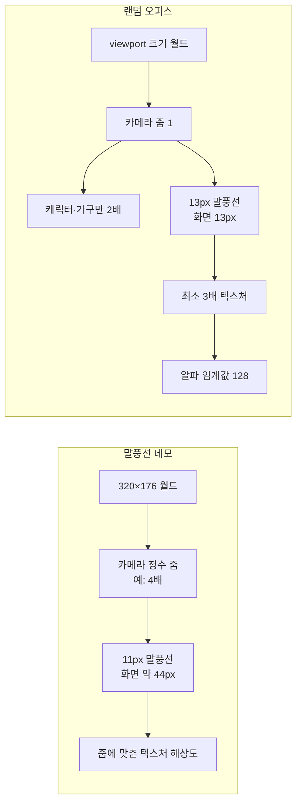

# 랜덤 오피스 말풍선 폰트 렌더링 트러블슈팅

> 2026-08-20 기준. `/demo/speech-bubble`, `/demo/speech-bubble-font`, `/demo/random-office-chatter`의 폰트 크기·잘림·행간·선명도 문제를 조사하고 개선한 기록입니다.

## 문제와 완료 상태

| 문제 | 원인 | 현재 처리 |
|---|---|---|
| 한글과 영문의 시각적 크기 차이 | `FS Pixel Sans`의 영문 ink 높이가 `Galmuri11` 한글보다 작음 | `FS Pixel Sans Matched`에 `size-adjust: 204%` 적용 |
| 첫 줄 윗부분 잘림 | Phaser `Text` 텍스처 위쪽에 글리프 안전 여백이 없음 | 텍스트 상단 padding `1px` 적용 |
| 여러 줄 텍스트 겹침 | Phaser `lineSpacing`이 선언한 CSS font size가 아니라 측정된 font metrics에 더해짐 | `fontSize × 1.2 - measuredFontSize - strokeThickness`로 계산 |
| 말풍선 내부 세로 정렬 | 실제 글리프가 line box 아래쪽에 치우침 | 기본 `-1px`, 랜덤 오피스 `-2px` Y 오프셋 적용 |
| 랜덤 오피스 텍스트의 흐린 가장자리 | 카메라 줌 `1`에서 고해상도 동적 텍스트의 반투명 가장자리가 그대로 축소됨 | 랜덤 오피스 말풍선에만 알파 임계값 `128` 적용 |

## 렌더링 경로의 차이

두 페이지는 동일한 Phaser 픽셀 렌더 설정과 폰트 스택을 사용하지만 확대 방식이 다릅니다.



`/demo/speech-bubble`은 `PhaserGame`과 `OfficeScene`의 정수 카메라 줌을 사용합니다. 반면 `/demo/random-office-chatter`는 브라우저 viewport를 월드 크기로 사용하고 카메라 줌을 바꾸지 않습니다. `PIXEL_VIEW_SCALE = 2`는 타일, 캐릭터, 가구에만 적용되고 말풍선은 화면 기준 `13px`입니다.

따라서 말풍선 데모의 4배 화면과 랜덤 오피스의 1배 화면을 비교하면 전자가 훨씬 선명해 보입니다. 말풍선 데모를 1배로 낮추면 두 화면의 선명도 차이가 크게 줄어드는 것을 직접 캡처로 확인했습니다.

## 한글·영문 크기 보정

13px 선언 크기에서 측정한 실제 ink 높이는 다음과 같습니다.

| 글꼴 | 문자열 범위 | 원본 ink 높이 |
|---|---|---:|
| `FS Pixel Sans` | 영문·숫자 | `5.6875px` |
| `Galmuri11` | 한글 | `11.9167px` |

영문 font face에 `size-adjust: 204%`를 적용하면 영문 ink 높이는 약 `11.60px`가 됩니다. 한글보다 약 2.6% 작아, 완전히 같은 크기보다 영문이 조금 작게 보이도록 한 요청도 유지합니다.

`size-adjust`는 시각적 글리프 높이를 맞추는 기능이지 모든 글꼴 윤곽을 물리 픽셀 격자에 맞추는 기능은 아닙니다. FS Pixel Sans와 Galmuri11의 내부 격자가 서로 다르고 CSS px와 디바이스 픽셀도 항상 1:1이 아니므로, 작은 크기에서 두 글꼴의 모든 획을 동시에 완전한 물리 픽셀에 맞추는 실용적인 단일 크기는 없습니다.

## 첫 줄 잘림과 120% 행간

Phaser `Text`는 Canvas 2D에 텍스트를 그린 뒤 텍스처로 업로드합니다. 첫 줄이 텍스처 상단에 닿으면 확대 화면에서 윗부분이 잘린 것처럼 보이므로 상단 padding `1px`을 둡니다.

Phaser의 `lineSpacing`은 CSS의 `line-height` 값과 의미가 다릅니다. 목표 행 높이가 120%라면 다음 식을 사용해야 합니다.

```text
lineSpacing = fontSizePx × 1.2 - textMetrics.fontSize - strokeThickness
```

11px 말풍선의 목표 행 높이는 `13.2px`, 랜덤 오피스 13px 말풍선의 목표 행 높이는 `15.6px`입니다. 4배 캡처에서 여러 줄 시작점 간격이 52~53px로 측정되어 11px 말풍선의 논리 행 높이 `13.2px`와 일치했습니다.

## 선명도 실험

모든 실험은 말풍선 표시 크기 `13px`, `FS Pixel Sans Matched`와 `Galmuri11` 조합, Phaser `pixelArt: true`, `antialias: false`, `roundPixels: true`를 유지한 상태에서 진행했습니다.

### 텍스처 해상도 1

최소 텍스처 해상도를 3에서 1로 낮추면 Canvas 2D의 반투명 가장자리가 더 많이 노출됐습니다.

- 중간 명암/어두운 픽셀 비율: `0.392 → 1.620`
- 영문 획이 더 불규칙하게 표시됨
- 결과: 기각

### 텍스처 해상도 4

최소 해상도를 3에서 4로 높이면 문장에 따라 일부 개선됐지만, 동일 문장 비교에서는 중간 명암/어두운 픽셀 비율이 `0.392 → 0.385`로 개선 폭이 약 2%에 그쳤습니다. 텍스처 면적과 갱신 비용은 약 1.78배가 되므로 유지하지 않았습니다.

### LINEAR 필터

스프라이트는 `NEAREST`로 두고 말풍선 텍스처만 `LINEAR`로 변경했습니다. 계단 현상은 부드러워졌지만 글자 가장자리의 중간 명암이 늘어 픽셀 폰트가 흐려졌습니다.

- 비교 샘플의 중간 명암/어두운 픽셀 비율: `0.276 → 0.428`
- 결과: 기각

### Phaser GameConfig 전체 해상도

게임 전체 backing store 해상도를 올리는 방식을 검토했으나 현재 Phaser `GameConfig`에 사용 가능한 설정이 아니며 실제 Canvas 크기도 바뀌지 않았습니다. 브라우저 DPR 변화가 결과에 섞일 수 있어 개선안에서 제외했습니다.

### 알파 임계값 128

최종안은 랜덤 오피스 말풍선 텍스처에만 적용하는 알파 이진화입니다. Phaser가 텍스트를 다시 그리거나 텍스처 해상도가 바뀔 때 알파가 128 이상이면 255, 미만이면 0으로 바꾼 뒤 텍스처 소스를 갱신합니다.

동일 문장 `내일의 문이 조용히 열린다`의 동일 크기 말풍선을 비교한 결과입니다.

| 측정값 | 적용 전 | 적용 후 |
|---|---:|---:|
| 중간 명암 픽셀 | 203 | 1 |
| 어두운 픽셀 | 518 | 589 |
| 중간 명암/어두운 픽셀 비율 | 0.392 | 0.002 |

말풍선 크기, 13px 표시 크기, 120% 행간, 위·아래 여백은 바뀌지 않았습니다. 스트리밍으로 최대 5줄까지 텍스트가 갱신된 뒤에도 보정이 다시 적용되는 것을 확인했습니다.

## 현재 구현

- `SpeechBubbleConfig.textAlphaThreshold`는 선택 값입니다.
- `SpeechBubble.syncTextureResolution()`이 텍스트를 다시 래스터라이즈한 직후 알파 임계값을 적용합니다.
- `reset()`도 `syncTextureResolution(true)`를 호출하므로 스트리밍 텍스트 갱신마다 보정됩니다.
- 랜덤 오피스의 일반 대화와 인사 말풍선만 `128`을 전달합니다.
- `/demo/speech-bubble`과 일반 Office Scene은 값을 전달하지 않으므로 기존 렌더링을 유지합니다.

## 검증 결과

- `npm run build` 통과
- `npm run lint` 통과
- `git diff --check` 통과
- 랜덤 오피스에서 단일 행, 여러 행, 한글·영문 혼합 말풍선을 직접 캡처해 확인
- `/demo/speech-bubble` 4배 줌에서 기존 첫 줄·행간·크기 렌더링에 회귀가 없는지 확인

이 프로젝트에는 자동화된 시각 회귀 테스트가 없으므로 현재 픽셀 측정은 브라우저 캡처를 대상으로 수동 실행했습니다.

## 나중에 할 작업

1. 랜덤 오피스에 시각 검증 전용 고정 seed 또는 debug route를 추가합니다. 에이전트 위치, 문장, 말풍선 갱신 시점을 고정하면 동일 픽셀을 자동 비교할 수 있습니다.
2. Playwright PNG 캡처와 픽셀 분석을 CI에 추가합니다. 한·영 ink 높이, 첫 줄 상단 여백, 행 시작점 간격, 중간 명암 픽셀 수를 회귀 조건으로 사용합니다.
3. 16개 에이전트의 `getImageData()`·`putImageData()` 비용을 프로파일링합니다. 장기 목표인 약 100개 에이전트까지 확장할 경우 dirty 영역 처리나 전용 bitmap font atlas를 검토합니다.
4. DPR 1·2, 브라우저 zoom 80~200%, 외부 모니터 조합에서 동일한 결과인지 확인합니다.
5. 장기적으로 랜덤 오피스도 수동 sprite 확대 대신 논리 월드와 정수 카메라 줌을 사용하는 구조로 통일할지 결정합니다. 이 경우 viewport 범위와 말풍선 표시 크기 정책을 함께 설계해야 합니다.
6. FS Pixel Sans와 Galmuri11을 사용하는 전용 bitmap font atlas를 평가합니다. 혼합 문자 fallback, 한글 글리프 수, atlas 메모리 사용량을 먼저 검증해야 합니다.
7. 알파 임계값을 다른 Scene에도 적용할지는 실제 작은 배율 사용 사례가 생긴 뒤 결정합니다. 현재는 랜덤 오피스에만 제한합니다.

## 관련 파일과 커밋

- `src/game/entities/SpeechBubble.ts`
- `src/ui/DemoRandomOfficeChatterRoute.tsx`
- `src/game/scenes/OfficeScene.ts`
- `src/game/PhaserGame.tsx`
- `src/index.css`
- `memory/speech-bubble-and-random-demo-rules.md`
- `memory/canvas-rendering.md`
- 기준 커밋: `210ab46 Update pixel font rendering and project research`
- 개선 커밋: `62c7524 Improve random office speech text crispness`
