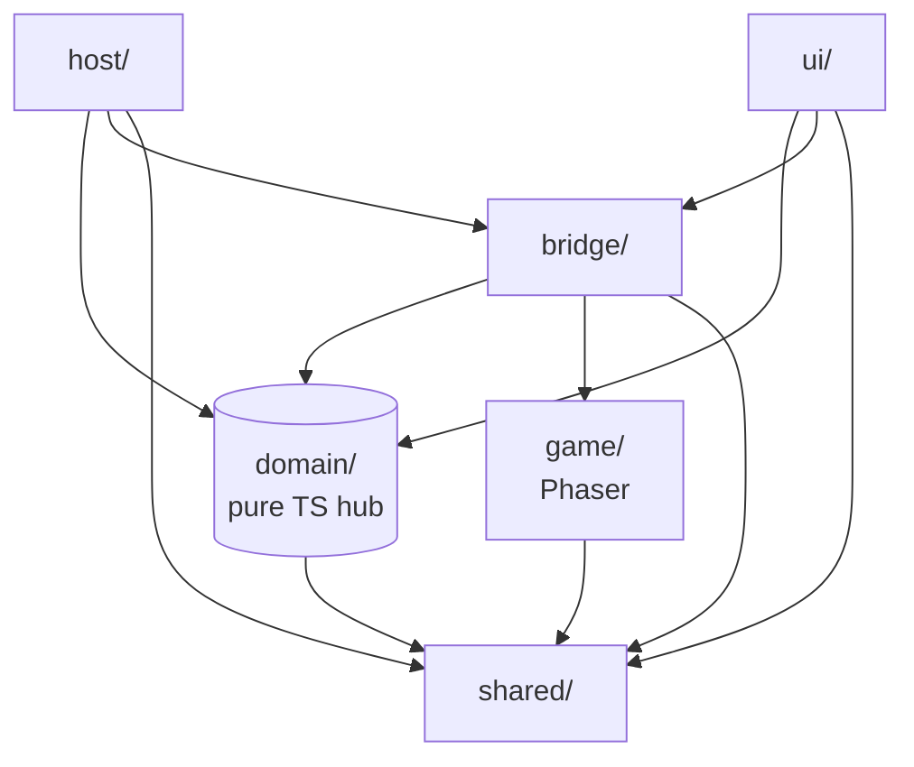

# 프로젝트 아키텍처 (제안)

> 2026-04-21 작성. v2 재작성의 구조적 뼈대입니다. React 셸이 Phaser 게임을 호스팅하는 본 프로젝트의 특성에 맞춰 **"Host ↔ Bridge ↔ Game" 3레이어 + Pure Domain 허브** 구조를 채택합니다.

## 왜 FSD / Clean / Hexagonal 이 아닌가

- **Feature Sliced Design**: `features/entities/widgets` 수직 분할 전제인데, 이 앱의 핵심 기능은 "에이전트 시각화" 하나라 features 슬라이싱의 이득이 없음.
- **Clean Architecture**: use case 레이어가 60fps 실시간 게임 루프와 결이 맞지 않음. 에이전트 이벤트→시각 상태 업데이트를 use case로 감싸는 건 과잉.
- **Hexagonal**: React/VS Code 어댑터 쪽으로는 훌륭하지만, 게임 내부(Scene/Entity/Rendering)에는 ports/adapters가 어색함.

선택한 구조는 **Hexagonal의 adapter 개념을 `host/`에만 선별 차용**, 게임 내부는 **Phaser 네이티브 Scene/System 패턴**을 따르고, 두 세계를 **순수 domain + bridge**가 이어주는 형태입니다.

## 디렉토리 구조

```
src/
├── app/                     # React 엔트리, providers, 라우팅
│   ├── main.tsx
│   └── App.tsx
│
├── host/                    # 외부 환경 어댑터 (Hexagonal adapter 개념)
│   ├── vscode/              # VS Code 웹뷰 브릿지
│   ├── browser/             # 스탠드얼론 브라우저 배포용
│   └── tauri/               # (미래) Tauri 네이티브 이벤트
│                            # 모두 domain/events.ts의 AgentEvent를 방출
│
├── domain/                  # Pure TypeScript. React/Phaser 의존 X
│   ├── agent.ts             # Agent, AgentStatus (typing/walking/idle/...)
│   ├── office.ts            # Office, Seat, TilesetVariant
│   ├── events.ts            # AgentEvent union type
│   └── mapping.ts           # "에이전트 상태 → 시각 상태" 순수 함수
│
├── bridge/                  # Host ↔ Game 통신. 본 프로젝트 고유 레이어
│   ├── gameBus.ts           # host→game, game→ui 이벤트 버스 (mitt 등)
│   ├── agentSync.ts         # AgentEvent → Phaser Scene 업데이트
│   └── selectionSync.ts     # 캔버스 선택/호버 → React UI
│
├── game/                    # Phaser 전용. 다른 레이어에서 이 디렉토리를 import 하지 않음
│   ├── PhaserGame.tsx       # React ref → Phaser.Game 부착
│   ├── scenes/
│   │   ├── OfficeScene.ts
│   │   └── BootScene.ts
│   ├── entities/            # Character, Furniture 등 GameObject wrapper
│   ├── systems/             # PathfindingSystem, SocialSystem, CameraFollow
│   ├── tiled/               # .tmj 로더, tileset variant 스위치
│   └── assets/              # 스프라이트/맵 manifest
│
├── ui/                      # 게임 바깥 React UI (패널/툴바/모달)
│   ├── AgentList/
│   ├── TilesetSwitcher/
│   └── DebugPanel/
│
└── shared/                  # 순수 유틸, 공용 타입, 상수
    ├── types/
    └── utils/
```

## 레이어 간 의존 규칙 (단방향)



엄격한 규칙:

1. **`domain`은 누구에게도 의존하지 않는다**. 외부 라이브러리(React, Phaser, VS Code API 등) import 금지.
2. **`host`는 외부 이벤트를 `domain` 타입으로 번역**해 `bridge`로 전달.
3. **`ui`는 `domain`과 `bridge`를 구독**해 상태 표시/조작 UI 제공. `game/`을 직접 import 하지 않음.
4. **`game`은 오직 `bridge`를 통해서만 외부와 통신**. Phaser 코드가 React/host에 직접 의존 금지.
5. **`shared`는 순수 타입/유틸만**. 상위 레이어에서 자유롭게 import 가능.

이 규칙은 ESLint `import/no-restricted-paths` 또는 `dependency-cruiser`로 자동 강제 가능.

## 각 레이어의 역할 요약

| 레이어 | 역할 | 핵심 산출물 예시 |
|---|---|---|
| `app/` | React 진입, Provider 조립 | `main.tsx`, `App.tsx` |
| `host/` | VS Code / Browser / Tauri 환경 감지 및 이벤트 수집 | `host/vscode/webviewBridge.ts` |
| `domain/` | 에이전트/오피스/이벤트의 순수 타입과 매핑 규칙 | `AgentEvent`, `mapStatusToVisual()` |
| `bridge/` | domain ↔ game 양방향 동기화 | `agentSync.ts`, `gameBus.ts` |
| `game/` | Phaser Scene, Entity, System, 맵 로딩 | `OfficeScene.ts`, `Character.ts` |
| `ui/` | 게임 바깥의 React UI | `TilesetSwitcher` |
| `shared/` | 공용 유틸, 상수, 브랜디드 타입 | `shared/utils/id.ts` |

## 이 구조의 이점

1. **"게임은 React 안의 이질적 이웃"이라는 사실을 구조로 인정**. `game/`이 블랙박스처럼 격리되고 `bridge/`가 유일한 통로.
2. **Domain이 Phaser-agnostic**. 나중에 엔진 재이식/재교체 시 `domain`과 `bridge` 인터페이스만 유지하면 됨.
3. **Host 어댑터 직교성**. VS Code / Browser / Tauri 세 어댑터가 나란히 살 수 있고, 새 환경 추가 시 `host/` 아래만 확장.
4. **테스트 경계가 명확**:
   - `domain/*`: 순수 함수 단위 테스트
   - `bridge/*`: 이벤트 통합 테스트 (mock host, mock game bus)
   - `game/*`: Phaser Scene 스모크/플레이 테스트
   - `host/*`: 외부 환경 모킹 테스트

## 참고 사례

- Phaser + React 공식 템플릿(`phaser-editor-template-react-ts`)이 이미 `PhaserGame.tsx`로 게임을 React ref에 박고 `EventBus`로 통신하는 패턴을 제시. 본 구조는 거기에 `domain/`과 `host/`를 얹은 형태.
- 게임 내부는 Phaser Scene 중심이 업계 표준. ECS(`bitecs`, `miniplex`)는 엔티티가 수백 개를 넘어갈 때 도입하면 되고, ~100 에이전트 규모에서는 불필요.
