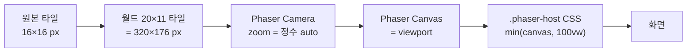

# Canvas 렌더링과 줌 파이프라인

> 2026-04-22 작성. v2(Phaser + Tiled) 기준으로 게임 캔버스가 원본 타일 픽셀과 어떤 비율로 표시되는지와, 관련 설정이 어느 파일에 흩어져 있는지 정리합니다.

## 렌더 체인



## 핵심 수치

| 항목 | 값 | 출처 |
|---|---|---|
| 타일 크기 | 16×16 px | `src/game/scenes/OfficeScene.ts:13` (`TARGET_TILE_SIZE = 16`), `public/maps/sample.tmj`의 `tilewidth/tileheight` |
| 샘플 맵 크기 | 20×11 타일 = **320×176 px** | `public/maps/sample.tmj` |
| Canvas 폭 옵션 | Small 640 / Medium 960 / Large 1280 | `src/game/PhaserGame.tsx:7-11` |
| Aspect 옵션 | 16:9, 4:3, 1:1, 20:11(Map) | `src/game/PhaserGame.tsx:12-17` |
| Canvas 높이 계산 | `round(width / ratio)` | `useCanvasSize` (`PhaserGame.tsx:124-130`) |

## 픽셀 선명도 관련 설정

- Phaser 인스턴스 (`src/game/PhaserGame.tsx:32-47`)
  - `render.pixelArt: true`, `render.roundPixels: true`, `render.antialias: false`
  - `scale.mode: Phaser.Scale.RESIZE` + `ResizeObserver`로 `game.scale.resize()` 호출 (`PhaserGame.tsx:51-55`)
- Scene 카메라 (`src/game/scenes/OfficeScene.ts:53-58`)
  - `camera.roundPixels = true`
  - `camera.setZoom(getIntegerZoom(...))` — 뷰포트 기반 자동 정수 줌
- CSS (`src/App.css:9-19`)
  - `.phaser-host { width: min(var(--canvas-width, 960px), 100vw); height: min(var(--canvas-height, 528px), 100vh); }`
  - **작은 브라우저 창에서는 CSS `min`이 캔버스를 비정수로 축소**할 수 있음 (픽셀 매치가 CSS 단계에서 깨질 여지).

## 줌 계산 로직

`src/game/scenes/OfficeScene.ts:360-363`

```
fitZoom = min(viewportW / worldW, viewportH / worldH)
zoom    = max(1, floor(fitZoom))
```

- 항상 **정수 배수**(1x/2x/3x/4x …)로 floor → 타일 선명도 유지.
- 뷰포트가 바뀌면 `handleResize`(`OfficeScene.ts:85-88`)에서 재계산하고 `camera.centerOn(worldW/2, worldH/2)`로 중앙 고정.

### 현재 옵션별 자동 줌 (20:11 Map 비율)

| Canvas 사이즈 | 뷰포트 | 계산 | 적용 줌 | 원본:화면 비율 |
|---|---|---|---|---|
| Small | 640×352 | min(2.00, 2.00) | **2x** | 1 : 2 |
| Medium | 960×528 | min(3.00, 3.00) | **3x** | 1 : 3 |
| Large | 1280×704 | min(4.00, 4.00) | **4x** | 1 : 4 |

- 20:11 비율에서는 뷰포트와 월드가 정확히 정수배 관계이므로 빈 여백 없이 픽셀 매치.
- 16:9 / 4:3 / 1:1에서는 줌은 여전히 정수로 floor되지만 위·아래 또는 좌·우에 빈 여백(카메라 배경)이 생김.

## 현재 한계

1. **사용자가 배율을 직접 고를 수 없음** — 뷰포트 크기가 배율을 강제로 결정.
2. **CSS `min(..., 100vw)`** 로 인해 작은 창에서 브라우저가 캔버스를 비정수 CSS 스케일 가능 → 블러.
3. **지금 몇 배로 보고 있는지 UI에 표시되지 않음**.
4. 옵션 축이 "Canvas 크기 × Aspect"라서 "픽셀 매치 우선"이 아님.

개선 계획은 [`plan/20260422-pixel-match-zoom.md`](plan/20260422-pixel-match-zoom.md) 참고.
