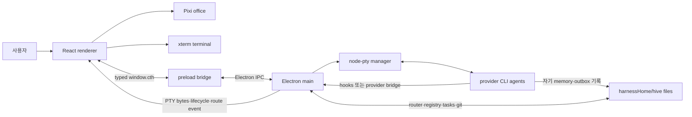

# Munder Difflin 디자인 에셋 및 라이선스 조사

## 조사 범위와 기준

- 조사 대상: [`chaitanyagiri/munder-difflin`](https://github.com/chaitanyagiri/munder-difflin) `main` 브랜치의 커밋 [`270b851786d3c16309db24ab51d97e2ba0f0d972`](https://github.com/chaitanyagiri/munder-difflin/tree/270b851786d3c16309db24ab51d97e2ba0f0d972)
- 확인일: 2026-08-20
- 방법: 저장소를 임시 디렉터리에 clone한 뒤 README, 패키지·Electron/Vite 구성, main/preload/renderer 소스, provider·hive·office domain 코드와 정적 파일, CSS `url()`, Google Fonts 요청, 지도 JSON, 라이선스·attribution을 대조했다. LimeZu 에셋의 중간 출처인 [`shahar061/the-office`](https://github.com/shahar061/the-office/tree/9a11be793321f19bf07e93a407e2dbaffe6151d7)와 Ian Xiaohei 원본 저장소도 별도로 clone해 비교했다.
- 최신성 재검토: 이전 조사 커밋에서 현재 커밋까지 바뀐 파일은 `docs/wall-data.json` 하나뿐이다. 앱 소스, 정적 에셋, attribution, 루트·하위 패키지 라이선스에는 변경이 없어 아래 인벤토리와 라이선스 판정은 현재 커밋에도 동일하다.
- 이 문서는 기술적 라이선스 실사이며 법률 자문이 아니다. 상업 배포 전에는 권리자 또는 법률 전문가에게 확인해야 한다.

## 프로젝트 목표와 실행 구조

### 목표

Munder Difflin은 기존에 사용하던 터미널형 코딩 에이전트 CLI를 로컬 데스크톱 앱 안에서 실제 프로세스로 실행하고, 여러 세션에 메모리·우편함·작업 원장·상태 관찰 기능을 붙이는 멀티 에이전트 harness다. 사용자는 각 터미널을 직접 다룰 수도 있고, “Michael”이라는 orchestrator 에이전트 한 명에게 요청해 기존 작업자에게 위임하거나 새 작업자를 띄우게 할 수도 있다. 픽셀 오피스는 별도 게임 상태를 보여주는 것이 아니라 PTY 출력, lifecycle hook, hive 메시지, 작업 상태를 캐릭터 이동과 말풍선으로 표현하는 관찰·제어 UI다. [README의 제품 설명과 How it works](https://github.com/chaitanyagiri/munder-difflin/blob/270b851786d3c16309db24ab51d97e2ba0f0d972/README.md#what-it-is), [`package.json`](https://github.com/chaitanyagiri/munder-difflin/blob/270b851786d3c16309db24ab51d97e2ba0f0d972/package.json)

README와 코드가 확인하는 핵심 성격은 다음과 같다.

- 각 agent는 `node-pty`로 실행되는 실제 Claude Code, Codex, Antigravity 등의 CLI 프로세스이며 xterm.js가 그 byte stream을 표시한다.
- 조정 상태는 `<harnessHome>/hive/`의 일반 파일과 git 이력에 저장된다. agent마다 identity, memory, inbox, outbox가 있고 main process의 router만 이 hive 저장소를 commit한다.
- Michael도 별도 내장 AI가 아니라 사용자가 고른 provider·model로 실행되는 `god` PTY agent다. renderer의 `useHive`가 없으면 자동 생성하고, 기존 session ID가 있으면 재개한 뒤 오케스트레이션 지시를 넣는다.
- Pixi 오피스, terminal, task board, memory, IDE, telemetry와 제어 장치는 같은 실행 상태를 서로 다른 관점으로 보여준다. [`hive.ts`](https://github.com/chaitanyagiri/munder-difflin/blob/270b851786d3c16309db24ab51d97e2ba0f0d972/src/main/hive.ts), [`useHive.ts`](https://github.com/chaitanyagiri/munder-difflin/blob/270b851786d3c16309db24ab51d97e2ba0f0d972/src/renderer/src/hooks/useHive.ts), [`CommandCenterPanel.tsx`](https://github.com/chaitanyagiri/munder-difflin/blob/270b851786d3c16309db24ab51d97e2ba0f0d972/src/renderer/src/components/CommandCenterPanel.tsx)

### 주요 사용자 흐름

1. 첫 실행에서 onboarding wizard가 사용자 유형, harness home, Michael의 provider·model, 작업할 저장소, 자동 실행·telemetry 설정을 받고 디렉터리와 config를 만든다. 이후 실행에서는 현재·최근 hive를 선택하거나 다른 hive를 열 수 있다. [`OnboardingWizard.tsx`](https://github.com/chaitanyagiri/munder-difflin/blob/270b851786d3c16309db24ab51d97e2ba0f0d972/src/renderer/src/components/OnboardingWizard.tsx), [`App.tsx`](https://github.com/chaitanyagiri/munder-difflin/blob/270b851786d3c16309db24ab51d97e2ba0f0d972/src/renderer/src/App.tsx)
2. hive가 열리면 `useHive`가 Michael의 PTY를 자동 생성하거나 이전 session을 재개한다. 사용자는 Add Agent에서 이름·역할·작업 폴더·provider·model·목표를 정하고, 선택적으로 별도 git worktree 또는 기존 session 재개를 요청한다. 공유 hire link는 폼만 채우며 자동 spawn하지 않는다. [`AddAgentModal.tsx`](https://github.com/chaitanyagiri/munder-difflin/blob/270b851786d3c16309db24ab51d97e2ba0f0d972/src/renderer/src/components/AddAgentModal.tsx)
3. 사용자는 오피스에서 agent를 선택해 terminal, message, trace, git 상태를 보고 직접 입력하거나, Michael의 Command Center에서 monitoring, task board, human 질문, trigger, memory·graph, activity, skill, 임시 worker를 관리한다. 내장 IDE는 main process가 중개하는 filesystem·git API를 통해 Monaco 편집·diff를 제공한다. [`AgentDetailPanel.tsx`](https://github.com/chaitanyagiri/munder-difflin/blob/270b851786d3c16309db24ab51d97e2ba0f0d972/src/renderer/src/components/AgentDetailPanel.tsx), [`IdePanel.tsx`](https://github.com/chaitanyagiri/munder-difflin/blob/270b851786d3c16309db24ab51d97e2ba0f0d972/src/renderer/src/ide/IdePanel.tsx)
4. agent가 자기 `outbox/`에 JSON을 쓰면 main process router가 대상의 `inbox/`로 옮기고 원본을 `.sent/`에 보관한다. renderer는 lifecycle·PTY idle 상태를 보고 받은 agent를 깨우거나 안전한 시점에 terminal work order를 전달한다. 외부 입력은 설정된 경우 Slack, webhook, schedule·context trigger를 통해 Michael 또는 작업 카드로 들어온다. [`hive.ts`의 router](https://github.com/chaitanyagiri/munder-difflin/blob/270b851786d3c16309db24ab51d97e2ba0f0d972/src/main/hive.ts), [`useHive.ts`의 전달 loop](https://github.com/chaitanyagiri/munder-difflin/blob/270b851786d3c16309db24ab51d97e2ba0f0d972/src/renderer/src/hooks/useHive.ts)

### Electron 런타임 구성

루트 `electron.vite.config.ts`가 main, preload, renderer를 별도 entry로 빌드한다. `package.json` 선언 기준 주 앱은 Electron 32, React 18, PixiJS 8, xterm.js, node-pty, Zustand, Monaco Editor를 사용한다. [`electron.vite.config.ts`](https://github.com/chaitanyagiri/munder-difflin/blob/270b851786d3c16309db24ab51d97e2ba0f0d972/electron.vite.config.ts), [`package.json`](https://github.com/chaitanyagiri/munder-difflin/blob/270b851786d3c16309db24ab51d97e2ba0f0d972/package.json)

| 경계 | 책임 | 구현상 주의점 |
|---|---|---|
| Electron main | 창·PTY process, hive/router/hooks, filesystem·git, SQLite, memory·knowledge, telemetry·breaker, secret broker, updater, Slack/webhook·voice integration | OS·Node 권한과 비밀을 소유하고 대부분의 `ipcMain` handler를 한 entry에서 등록한다 |
| preload | `ipcRenderer` 호출·event 구독을 typed `window.cth` API로 제한해 renderer에 노출 | provider key와 integration secret은 값 대신 저장·존재 확인 API만 제공하며 일부 message content는 main에서 redaction한다 |
| React renderer | onboarding·floor·sidebar·Command Center·IDE·settings, Zustand UI 상태와 message queue | Node integration 없이 preload API로만 privileged 작업을 요청한다. hive 자동 부팅·전달 일부는 `useHive` effect에서 수행한다 |
| Pixi office | Tiled map, agent character, pathfinding, station·seat, envelope·bubble, 카메라와 WebGL 복구 | React가 소유한 agent state를 시각화하며 자체적인 agent 실행 엔진은 아니다 |

BrowserWindow는 `contextIsolation: true`, `nodeIntegration: false`, `sandbox: false`이며, background window에서도 hive timer가 멈추지 않도록 `backgroundThrottling: false`다. 따라서 renderer와 Node 사이의 실제 권한 경계는 preload의 `window.cth` 표면과 main의 입력 검증이다. 외부 링크는 새 Electron 창 대신 OS browser로 연다. [`src/main/index.ts`의 window·service 구성](https://github.com/chaitanyagiri/munder-difflin/blob/270b851786d3c16309db24ab51d97e2ba0f0d972/src/main/index.ts), [`src/preload/index.ts`](https://github.com/chaitanyagiri/munder-difflin/blob/270b851786d3c16309db24ab51d97e2ba0f0d972/src/preload/index.ts)

### provider와 agent orchestration

공유 `agentProvider.ts`는 Claude, Codex, Grok, Kimi, Antigravity, Qwen, OpenCode, Crush, pi, GitHub Copilot, custom provider의 command·model flag, 자동 실행 flag, resume 방식, installer, lifecycle bridge와 inbox 수신 가능 여부를 preset으로 정의한다. provider에 따라 Claude식 native hook, 호환 hook shim, loopback proxy 또는 PTY 상태 fallback을 사용하므로 모든 CLI의 관측·메시지 전달 정밀도가 완전히 같다고 보기는 어렵다. [`agentProvider.ts`](https://github.com/chaitanyagiri/munder-difflin/blob/270b851786d3c16309db24ab51d97e2ba0f0d972/src/shared/agentProvider.ts)

main의 `HiveManager`는 per-agent identity·protocol·환경변수를 만들고 registry, board, tasks, event log와 mailbox를 관리한다. renderer의 `useHive`는 hook event를 agent 상태·station으로 변환하고, inbox wake-up, busy-agent queue, provider별 seed prompt, sleep 이후 PTY revive를 조정한다. 이 구조상 “orchestration”은 Michael의 모델 판단, main의 파일 router·hook service, renderer의 전달 effect로 나뉜다. 단일 서버형 coordinator 하나가 모든 상태를 소유하는 구조는 아니다. [`hive.ts`](https://github.com/chaitanyagiri/munder-difflin/blob/270b851786d3c16309db24ab51d97e2ba0f0d972/src/main/hive.ts), [`useHive.ts`](https://github.com/chaitanyagiri/munder-difflin/blob/270b851786d3c16309db24ab51d97e2ba0f0d972/src/renderer/src/hooks/useHive.ts)

### office·theme domain

`ThemeConfig`는 한 테마가 제공해야 할 Tiled map, 순서가 고정된 tileset, 좌석·카페·errand 위치, monitor GID, palette, cast loader를 묶는다. `OfficeFloor`는 이 contract를 읽어 Pixi application, map renderer, character runtime, pathfinding, desk screen, message envelope를 구성한다. Zustand `Agent`는 provider·PTY·status·action·station·worktree·context 등 UI와 관찰에 필요한 상태를 보유한다. 현재 `office`가 기본 완성 테마이고 `brooklyn99`는 같은 제한 타일셋과 cast를 재사용하는 placeholder다. [`themeRegistry.ts`](https://github.com/chaitanyagiri/munder-difflin/blob/270b851786d3c16309db24ab51d97e2ba0f0d972/src/renderer/src/scene/office/themeRegistry.ts), [`OfficeFloor.tsx`](https://github.com/chaitanyagiri/munder-difflin/blob/270b851786d3c16309db24ab51d97e2ba0f0d972/src/renderer/src/scene/office/OfficeFloor.tsx), [`store.ts`](https://github.com/chaitanyagiri/munder-difflin/blob/270b851786d3c16309db24ab51d97e2ba0f0d972/src/renderer/src/store/store.ts)

### 웹·콘텐츠 서브프로젝트

- `docs/`는 GitHub Pages로 배포되는 마케팅 사이트, Agent Gallery, wall, privacy·terms, screenshot·media와 빌드된 블로그를 담는다.
- `blog/`는 별도 `package.json`을 가진 Eleventy 3 프로젝트다. Markdown·Nunjucks 원본을 `docs/blog/`와 루트 sitemap으로 빌드하며 Electron 앱 의존성과 분리돼 있다. [`blog/package.json`](https://github.com/chaitanyagiri/munder-difflin/blob/270b851786d3c16309db24ab51d97e2ba0f0d972/blog/package.json), [`BLOG_README.md`](https://github.com/chaitanyagiri/munder-difflin/blob/270b851786d3c16309db24ab51d97e2ba0f0d972/blog/BLOG_README.md)
- `landing-remotion/`은 landing page용 loop 영상을 `docs/media/`로 렌더하는 독립 Remotion 프로젝트이며 앱 runtime dependency가 아니다. [`landing-remotion/package.json`](https://github.com/chaitanyagiri/munder-difflin/blob/270b851786d3c16309db24ab51d97e2ba0f0d972/landing-remotion/package.json)

### 핵심 디렉터리

| 경로 | 역할 |
|---|---|
| `src/main/` | Electron privileged runtime, PTY·hive·memory·telemetry·integration·IPC |
| `src/preload/` | main 기능을 renderer에 제한적으로 노출하는 typed bridge |
| `src/shared/` | provider·trigger·integration·hire 등 main/renderer 공용 dependency-free contract |
| `src/renderer/src/components/` | onboarding, terminal, Command Center, task·message·settings UI |
| `src/renderer/src/scene/office/` | Pixi office, theme, map, character, pathfinding과 시각 effect |
| `src/renderer/src/store/`, `hooks/` | Zustand agent/UI state, PTY parsing과 hive 자동화 effect |
| `src/renderer/src/ide/` | Monaco editor·diff와 git pane |
| `src/renderer/src/assets/` | Tiled map, tileset, 남아 있는 character PNG와 attribution |
| `blog/`, `docs/` | Eleventy 콘텐츠 원본과 GitHub Pages 배포 산출물·마케팅 asset |
| `landing-remotion/` | 마케팅 영상 생성 프로젝트 |
| `tools/`, `test/` | 지도·로고·배포 보조 도구와 Node focused test |

## 정적 파일 인벤토리

대상 커밋 전체에서 디자인·미디어 확장자를 집계한 결과는 아래와 같다. 빌드 산출물도 저장소에 커밋돼 있어 원본과 중복 집계했다.

| 형식 | 수량 | 주요 구성 |
|---|---:|---|
| PNG | 814 | 블로그 원본 389개 + 동일한 배포본 389개, Ian 예시 14개, 앱 타일·캐릭터 10개, 로고·스크린샷·마케팅 이미지 12개 |
| SVG | 5 | 문서용 로고·배너·영상 poster 4개, 빌드 아이콘 1개 |
| ICO | 1 | Electron 빌드 아이콘 |
| GIF | 1 | Product Hunt용 thumbnail |
| JPG | 5 | demo 영상 poster |
| MP4 | 7 | 홍보·demo 영상 |
| WebM | 4 | 홍보·사용법 영상 |
| TMJ | 4 | 실제 테마 맵 2개, 미사용 lobby 1개, map generator 원본 1개 |
| 로컬 폰트·독립 오디오·3D 모델 | 0 | 폰트는 Google Fonts 원격 요청, 오디오는 일부 영상 스트림에만 존재 |

## 디자인 자산·라이선스 결론

현재 애플리케이션이 화면에 실제로 사용하는 핵심 시각 자산은 다음과 같다.

1. LimeZu 기반 오피스 타일셋 3개와 Tiled 맵 2개
2. 코드로 직접 그리는 *The Office* 등장인물 15명의 픽셀 초상·보행 프레임
3. 프로젝트 고유 로고, 수제 인라인 SVG 아이콘, Simple Icons에서 복사한 공급자 브랜드 마크
4. Google Fonts에서 네트워크로 불러오는 `Press Start 2P`, `Inter`, `JetBrains Mono`
5. CSS 그라디언트 배경과 data-URI SVG 커서

가장 중요한 제한은 LimeZu 자산이다. 저장소에 동봉된 라이선스는 **비상업 프로젝트에서의 사용·편집만 허용**하고 상업 사용을 금지한다. 저장소의 MIT 라이선스도 이 타일셋·맵·캐릭터 시트를 명시적으로 제외한다. 따라서 pixel-office에는 이 자산과 이를 사용한 맵을 복사하지 않는 것이 안전하다. [Munder Difflin의 LICENSE](https://github.com/chaitanyagiri/munder-difflin/blob/270b851786d3c16309db24ab51d97e2ba0f0d972/LICENSE), [에셋 attribution](https://github.com/chaitanyagiri/munder-difflin/blob/270b851786d3c16309db24ab51d97e2ba0f0d972/src/renderer/src/assets/ATTRIBUTION.md)

또한 현재 캐릭터는 LimeZu PNG를 실행 중에 쓰지 않지만, NBC의 *The Office* 인물 이름·특징·유사성을 의도적으로 구현한다. 저장소 자신도 비공식 패러디라고 밝힐 뿐 NBC로부터의 라이선스를 제시하지 않는다. 프로젝트 고유 로고와 마케팅 미디어도 별도 재사용 허가가 없다. 이 항목들은 pixel-office에서 재사용하지 않는 것이 보수적 결론이다. [README의 라이선스·비제휴 고지](https://github.com/chaitanyagiri/munder-difflin/blob/270b851786d3c16309db24ab51d97e2ba0f0d972/README.md#license)

## 애플리케이션에서 실제 사용하는 자산

### 1. LimeZu 타일셋과 Tiled 맵

[`themeRegistry.ts`](https://github.com/chaitanyagiri/munder-difflin/blob/270b851786d3c16309db24ab51d97e2ba0f0d972/src/renderer/src/scene/office/themeRegistry.ts)는 아래 파일만 직접 import한다.

| 종류 | 저장소 경로 | 실제 사용 |
|---|---|---|
| 타일 아틀라스 | `src/renderer/src/assets/tilesets/office-tileset.png` | 기본 오피스와 Brooklyn 99 임시 테마의 바닥·벽·가구 |
| 타일 아틀라스 | `src/renderer/src/assets/tilesets/a5-office-floors-walls.png` | 벽·바닥 확장 GID 513부터 |
| 타일 아틀라스 | `src/renderer/src/assets/tilesets/interiors.png` | 실내 가구 확장 GID 1025부터 |
| Tiled 맵 | `src/renderer/src/assets/maps/office.tmj` | 기본 오피스 레이아웃·충돌·좌석·구역 |
| Tiled 맵 | `src/renderer/src/assets/maps/brooklyn99.tmj` | Brooklyn 99 구조용 맵. 아직 동일한 LimeZu 오피스 아틀라스를 재사용하는 placeholder |

`brooklyn99.tmj` 자체는 새 배치이지만 기존 LimeZu 타일 GID를 그대로 사용하므로, 화면 결과물을 만들려면 같은 제한 자산이 필요하다. 소스 주석도 향후 “license-clean” 아트로 교체할 placeholder라고 명시한다. [테마 정의](https://github.com/chaitanyagiri/munder-difflin/blob/270b851786d3c16309db24ab51d97e2ba0f0d972/src/renderer/src/scene/office/themeRegistry.ts#L219-L233)

아래 파일은 저장소에 남아 있으나 현재 앱 코드에서 import되지 않는다.

- `tilesets/A2 Office Floors.png`
- `tilesets/A4 Office Walls.png`
- `tilesets/room-builder.png`
- `maps/lobby.tmj`
- `characters/{Adam,Alex,Amelia,Bob}_walk.png`

`tools/mapgen/original-office.tmj`도 실행 앱이 아닌 지도 생성 스크립트의 stamp 원본으로 남아 있다. 이 파일은 `shahar061/the-office`의 `office.tmj`와 SHA-256이 동일하므로 같은 LimeZu·ISC 조건을 받는다. [`build_map.py`](https://github.com/chaitanyagiri/munder-difflin/blob/270b851786d3c16309db24ab51d97e2ba0f0d972/tools/mapgen/build_map.py)

현재 `cast.ts`는 정적 초상과 장면 보행 프레임을 모두 `portraitArt.ts`의 코드 생성 결과로 만든다. 따라서 attribution 문서의 “캐릭터 시트를 recolor source로 사용한다”는 설명은 현재 실행 경로와 일치하지 않는 오래된 설명이다. 파일이 저장소와 배포물에 포함될 수 있다는 사실과 라이선스 제한은 별개로 남는다. [`cast.ts`](https://github.com/chaitanyagiri/munder-difflin/blob/270b851786d3c16309db24ab51d97e2ba0f0d972/src/renderer/src/scene/office/cast.ts#L1-L10), [`portraitArt.ts`](https://github.com/chaitanyagiri/munder-difflin/blob/270b851786d3c16309db24ab51d97e2ba0f0d972/src/renderer/src/scene/office/portraitArt.ts)

#### 출처 검증

Munder Difflin은 해당 파일이 LimeZu에서 시작해 `shahar061/the-office`를 통해 vendoring되었다고 밝힌다. 비교 시점의 `the-office` 커밋은 [`9a11be793321f19bf07e93a407e2dbaffe6151d7`](https://github.com/shahar061/the-office/tree/9a11be793321f19bf07e93a407e2dbaffe6151d7)이며, 캐릭터 시트 4개, `A2`, `A4`, `a5`, `interiors`, `room-builder`, `lobby.tmj`는 SHA-256까지 동일했다. `office-tileset.png`와 `office.tmj`는 Munder Difflin 쪽에서 수정되어 해시가 달랐으므로 LimeZu 기반 파생 편집물로 보는 것이 안전하다. 중간 저장소의 ISC 라이선스는 해당 저장소 작성자의 코드 권한일 뿐, 별도 LimeZu 자산 제한을 없애지 않는다. 또한 ISC는 저작권·허가 고지를 모든 복제물에 유지하도록 요구한다. Munder Difflin의 attribution에는 중간 출처 링크와 라이선스명이 있지만 ISC 원문은 동봉하지 않아, 그 지도·레이아웃 파생물을 배포할 때 고지 요건이 충족되는지는 별도 확인이 필요하다. pixel-office가 해당 파일을 복사한다면 ISC 고지와 LimeZu 조건을 모두 검토해야 하며, 후자의 비상업 제한 때문에 결론은 여전히 재사용 금지다. [`the-office` ISC LICENSE](https://github.com/shahar061/the-office/blob/9a11be793321f19bf07e93a407e2dbaffe6151d7/LICENSE), [`the-office`에 포함된 LimeZu 라이선스](https://github.com/shahar061/the-office/blob/9a11be793321f19bf07e93a407e2dbaffe6151d7/src/renderer/src/assets/tilesets/LIMEZUASSETS-LICENSE.txt)

#### 라이선스 판정

| 항목 | 판정 |
|---|---|
| 비상업적 사용 | 허용 |
| 비상업적 수정 | 허용 |
| 상업적 사용·수정 | 금지 |
| 재판매 | 편집 후 재판매가 명시적으로 금지됨 |
| 원본 파일의 독립 재배포 | 동봉된 짧은 라이선스에 명확한 허용 조항이 없어 허용으로 추정하면 안 됨 |
| attribution | 동봉 라이선스에는 명시 의무가 없지만 저장소는 LimeZu와 중간 출처를 고지함 |

근거는 저장소에 동봉된 [`LIMEZUASSETS-LICENSE.txt`](https://github.com/chaitanyagiri/munder-difflin/blob/270b851786d3c16309db24ab51d97e2ba0f0d972/src/renderer/src/assets/tilesets/LIMEZUASSETS-LICENSE.txt)다. LimeZu 공식 페이지에서도 Modern Interiors 무료판은 비상업 용도라고 설명한다. Modern Interiors와 Modern Office 유료판은 상업·비상업 프로젝트 사용과 편집을 허용하되 자산 자체의 재판매·재배포를 제한하고 크레딧을 요구한다. 현재 저장소 파일이 어느 유료 패키지·버전과 정확히 대응하는지 증빙이 없으므로, 유료 라이선스를 새로 구입했다는 이유만으로 기존 복사본 전체가 자동 정리된다고 가정해서는 안 된다. [LimeZu Modern Interiors 공식 페이지](https://limezu.itch.io/moderninteriors), [무료판 공식 안내](https://limezu.itch.io/moderninteriors/devlog/244045/free-version-overview-18042021-update), [LimeZu Modern Office 공식 페이지](https://limezu.itch.io/modernoffice)

### 2. 코드 생성 캐릭터와 프로젝트 로고

[`portraitArt.ts`](https://github.com/chaitanyagiri/munder-difflin/blob/270b851786d3c16309db24ab51d97e2ba0f0d972/src/renderer/src/scene/office/portraitArt.ts)는 18×28 초상과 18×32 보행 프레임을 픽셀 버퍼로 직접 생성한다. `cast.ts`에는 Michael, Jim, Pam, Dwight 등 *The Office* 인물 15명의 이름과 특징이 명시돼 있다. 즉 LimeZu 저작물과는 분리되었지만, TV 프로그램 인물의 이름·캐릭터 설정·의도된 유사성 문제까지 사라진 것은 아니다. [`cast.ts`의 roster](https://github.com/chaitanyagiri/munder-difflin/blob/270b851786d3c16309db24ab51d97e2ba0f0d972/src/renderer/src/scene/office/cast.ts#L12-L45)

`docs/logo.svg`, `docs/logo.png`, `docs/logo-light.png`, favicon, Apple touch icon, `build/icon.*`은 [`tools/make-logo.cjs`](https://github.com/chaitanyagiri/munder-difflin/blob/270b851786d3c16309db24ab51d97e2ba0f0d972/tools/make-logo.cjs)가 같은 Michael 픽셀 레시피로 생성한다. 앱은 Vite alias `@brand`를 통해 `docs/logo.png`를 실제 toolbar·favicon에 사용한다. [`electron.vite.config.ts`](https://github.com/chaitanyagiri/munder-difflin/blob/270b851786d3c16309db24ab51d97e2ba0f0d972/electron.vite.config.ts), [`App.tsx`](https://github.com/chaitanyagiri/munder-difflin/blob/270b851786d3c16309db24ab51d97e2ba0f0d972/src/renderer/src/App.tsx), [`main.tsx`](https://github.com/chaitanyagiri/munder-difflin/blob/270b851786d3c16309db24ab51d97e2ba0f0d972/src/renderer/src/main.tsx)

생성 코드 자체는 프로젝트 MIT 적용 대상이므로 저작권 고지와 MIT 문구를 포함해 코드 사용·수정·배포가 가능하다. 그러나 저장소의 라이선스는 Munder Difflin 상표나 NBC 측 캐릭터·프로그램 권리를 허가하지 않으며, 완성 로고·인물 아트에 별도 자산 라이선스도 제시하지 않는다. 따라서 pixel-office에서 코드나 결과 이미지를 복사하지 않는 것이 안전하다.

### 3. 아이콘

#### 프로젝트 수제 아이콘

[`components/Icon.tsx`](https://github.com/chaitanyagiri/munder-difflin/blob/270b851786d3c16309db24ab51d97e2ba0f0d972/src/renderer/src/components/Icon.tsx)는 gear, plus, terminal, folder 등 20여 개 16×16 아이콘을 정수 좌표 인라인 SVG path로 직접 정의한다. 외부 아이콘 패키지는 사용하지 않는다. 이 소스 코드는 MIT로 상업 사용·수정·재배포가 가능하지만, 복사할 경우 Munder Difflin의 저작권 고지와 MIT 라이선스를 유지해야 한다.

#### 공급자 브랜드 마크

[`components/ProviderLogo.tsx`](https://github.com/chaitanyagiri/munder-difflin/blob/270b851786d3c16309db24ab51d97e2ba0f0d972/src/renderer/src/components/ProviderLogo.tsx)는 Anthropic, OpenAI, Google Gemini, Qwen의 단색 SVG path가 Simple Icons에서 왔다고 밝힌다. Simple Icons 저장소 자체는 CC0-1.0이지만, 공식 disclaimer는 개별 브랜드 아이콘이 모두 CC0라는 뜻이 아니며 상표권·브랜드 가이드 권한을 별도로 확인해야 한다고 명시한다. [Simple Icons LICENSE](https://github.com/simple-icons/simple-icons/blob/34c22501f9ac9f22b12f825677ccbab1fb22e14b/LICENSE.md), [Simple Icons DISCLAIMER](https://github.com/simple-icons/simple-icons/blob/34c22501f9ac9f22b12f825677ccbab1fb22e14b/DISCLAIMER.md)

특히 이 프로젝트는 Simple Icons 버전을 고정하거나 각 path의 원본 커밋·개별 라이선스를 기록하지 않는다. 현재 Simple Icons 카탈로그에는 OpenAI 아이콘이 없고 Anthropic·Gemini·Qwen 항목에도 별도 아이콘 라이선스 데이터가 없다. 따라서 이 path를 다시 복사하기보다 각 공급자의 최신 공식 brand kit과 사용 조건을 확인해 제공자 식별 목적에만 사용하는 편이 안전하다. CC0는 상표 사용 허가가 아니다.

### 4. 폰트

폰트 파일은 저장소에 포함하지 않고 Google Fonts CSS API로 불러온다. Electron renderer의 실제 폰트 요청은 [`src/renderer/index.html`](https://github.com/chaitanyagiri/munder-difflin/blob/270b851786d3c16309db24ab51d97e2ba0f0d972/src/renderer/index.html)에 있으며, [`tokens.css`](https://github.com/chaitanyagiri/munder-difflin/blob/270b851786d3c16309db24ab51d97e2ba0f0d972/src/renderer/src/design/tokens.css)는 아래 3개만 현재 앱 토큰으로 사용한다.

| 영역 | 폰트 | 라이선스 |
|---|---|---|
| display | Press Start 2P | SIL Open Font License 1.1 |
| UI | Inter | SIL Open Font License 1.1 |
| terminal/code | JetBrains Mono | SIL Open Font License 1.1 |

웹사이트·블로그·렌더 도구까지 포함하면 Space Grotesk, Pixelify Sans, VT323, Geist, Fraunces, Source Serif 4, Bricolage Grotesque, Nunito Sans, Caveat도 Google Fonts로 요청한다. 모두 Google Fonts 공식 저장소에서 OFL-1.1 파일이 확인된다.

- [Press Start 2P OFL](https://github.com/google/fonts/blob/main/ofl/pressstart2p/OFL.txt)
- [Inter OFL](https://github.com/google/fonts/blob/main/ofl/inter/OFL.txt)
- [JetBrains Mono OFL](https://github.com/google/fonts/blob/main/ofl/jetbrainsmono/OFL.txt)
- [Space Grotesk OFL](https://github.com/google/fonts/blob/main/ofl/spacegrotesk/OFL.txt)
- [Pixelify Sans OFL](https://github.com/google/fonts/blob/main/ofl/pixelifysans/OFL.txt)
- [VT323 OFL](https://github.com/google/fonts/blob/main/ofl/vt323/OFL.txt)
- [Geist OFL](https://github.com/google/fonts/blob/main/ofl/geist/OFL.txt)
- [Fraunces OFL](https://github.com/google/fonts/blob/main/ofl/fraunces/OFL.txt)
- [Source Serif 4 OFL](https://github.com/google/fonts/blob/main/ofl/sourceserif4/OFL.txt)
- [Bricolage Grotesque OFL](https://github.com/google/fonts/blob/main/ofl/bricolagegrotesque/OFL.txt)
- [Nunito Sans OFL](https://github.com/google/fonts/blob/main/ofl/nunitosans/OFL.txt)
- [Caveat OFL](https://github.com/google/fonts/blob/main/ofl/caveat/OFL.txt)

OFL 폰트는 상업·비상업 사용, 임베딩, 수정, 재배포가 가능하다. 폰트 파일을 self-host하거나 앱과 함께 재배포할 때는 저작권·OFL 문구를 동봉하고, 수정판은 각 폰트의 Reserved Font Name 조건을 지켜야 하며, 폰트 자체만 단독 판매해서는 안 된다. Google도 Fonts 카탈로그가 오픈소스 라이선스이며 상업 프로젝트에 사용할 수 있다고 안내한다. [Google Fonts 공식 안내](https://developers.google.com/fonts)

### 5. CSS 배경과 커서

[`global.css`](https://github.com/chaitanyagiri/munder-difflin/blob/270b851786d3c16309db24ab51d97e2ba0f0d972/src/renderer/src/design/global.css)는 외부 배경 이미지를 사용하지 않는다.

- 본문 질감: `repeating-linear-gradient`로 만든 대각선 패턴
- 텍스트 선택 커서: CSS data-URI에 직접 넣은 17×18 SVG I-beam
- 메모리 그래프 격자·화살표: React 안의 인라인 SVG 정의

모두 프로젝트 소스 코드의 일부이므로 MIT 조건으로 재사용할 수 있다. 복사한다면 저작권·MIT 고지를 유지한다.

### 6. UI·렌더링·미디어 생성 라이브러리

PixiJS는 타일과 캐릭터를 그리는 렌더러일 뿐 자체 오피스 아트를 제공하지 않는다. Monaco Editor는 편집기 UI와 내부 아이콘/CSS를 제공하지만 프로젝트는 worker와 Monaco 인스턴스를 번들링해 기본 CDN 로딩을 명시적으로 막는다. [`monaco.ts`](https://github.com/chaitanyagiri/munder-difflin/blob/270b851786d3c16309db24ab51d97e2ba0f0d972/src/renderer/src/ide/monaco.ts), [`package-lock.json`](https://github.com/chaitanyagiri/munder-difflin/blob/270b851786d3c16309db24ab51d97e2ba0f0d972/package-lock.json)

확인된 PixiJS, Monaco Editor, `@monaco-editor/react`, xterm.js, commit-graph 패키지는 MIT다. 이들의 UI 조각을 직접 추출하기보다 해당 패키지를 의존성으로 사용하고 배포 시 third-party notices를 유지하는 방식이 적절하다. [Monaco Editor v0.52.2 LICENSE](https://github.com/microsoft/monaco-editor/blob/v0.52.2/LICENSE.txt), [PixiJS LICENSE](https://github.com/pixijs/pixijs/blob/main/LICENSE), [xterm.js LICENSE](https://github.com/xtermjs/xterm.js/blob/master/LICENSE)

예외적으로 `landing-remotion/`은 홍보 영상 생성에 Remotion `4.0.286`을 사용한다. 이 버전은 MIT가 아니라 별도 Remotion License다. 개인, 비영리 조직, 비상업 평가, 직원 3명 이하 영리 조직은 무료 사용 대상이지만 그보다 큰 영리 조직은 회사 라이선스가 필요하다. Remotion 파생물을 판매·임대·재라이선스할 수 없다는 제한도 있다. 이는 영상 생성 도구의 사용 조건일 뿐, 생성된 Munder 영상의 복사·재배포 권한을 제3자에게 부여하지 않는다. [`landing-remotion/package.json`](https://github.com/chaitanyagiri/munder-difflin/blob/270b851786d3c16309db24ab51d97e2ba0f0d972/landing-remotion/package.json), [Remotion 4.0.286 LICENSE](https://github.com/remotion-dev/remotion/blob/v4.0.286/LICENSE.md)

## 웹사이트·블로그에 포함된 디자인 자산

### 브랜드·스크린샷·영상

`docs/`와 `build/`에는 로고·아이콘 파생본, 앱 스크린샷, 소셜 카드, Product Hunt 이미지, GIF와 홍보 영상이 있다.

- `docs/screenshots/*.png`: 앱 화면 캡처 3개
- `docs/media/`: PNG 3개, SVG 1개, GIF 1개, MP4 7개, WebM 4개, JPG poster 5개
- `docs/media/demo/*.mp4`: 소리가 포함된 narrated screen recording 5개이며 poster는 영상 프레임에서 추출됨
- `docs/logo*`, `docs/banner*`, `build/icon*`: 프로젝트 브랜드 이미지

영상·poster의 생성 경로는 [`docs/media/README.md`](https://github.com/chaitanyagiri/munder-difflin/blob/270b851786d3c16309db24ab51d97e2ba0f0d972/docs/media/README.md)와 [`docs/media/demo/README.md`](https://github.com/chaitanyagiri/munder-difflin/blob/270b851786d3c16309db24ab51d97e2ba0f0d972/docs/media/demo/README.md)에 기록돼 있다. 그러나 루트 LICENSE는 소스 코드에 대한 MIT라고 범위를 한정하며, 이 브랜드·스크린샷·영상에 별도 자산 라이선스를 부여하지 않는다. 따라서 저장소에 공개돼 있다는 사실만으로 상업 사용·수정·재배포가 허용된다고 볼 수 없다.

### 블로그 일러스트

`blog/src/assets/media/`에는 129개 글의 hero 129개와 inline 이미지 260개, 총 389개의 PNG가 있다. `docs/blog/assets/media/`의 389개 파일은 빌드 출력이며 원본과 SHA-256이 모두 일치하는 복제본이다. manifest와 생성 구조는 [`blog/src/_data/media.json`](https://github.com/chaitanyagiri/munder-difflin/blob/270b851786d3c16309db24ab51d97e2ba0f0d972/blog/src/_data/media.json)에 있다.

[`BLOG_README.md`](https://github.com/chaitanyagiri/munder-difflin/blob/270b851786d3c16309db24ab51d97e2ba0f0d972/blog/BLOG_README.md#images-video-and-the-media-manifest)는 hero가 `scene-lib.js`와 `spec.js`를 브라우저에서 렌더한 코드 드로잉이며 선택적으로 OpenAI Images 파이프라인도 존재한다고 설명한다. 현재 manifest는 각 완성 PNG가 어느 파이프라인으로 만들어졌는지 파일별 provenance나 출력 라이선스를 기록하지 않는다. 특히 inline 이미지 260개는 완성 상태만 표시된다. 따라서 이 PNG들을 루트 MIT로 재사용할 수 있다고 추정해서는 안 된다.

그림 스타일은 vendoring된 `Ian Xiaohei Illustrations` skill을 변형했다. 동봉된 skill LICENSE는 MIT이고, 14개 calibration example과 NOTICE는 upstream 커밋 [`91b560849e8f883922cc2fa8a358a668caa94105`](https://github.com/helloianneo/ian-xiaohei-illustrations/tree/91b560849e8f883922cc2fa8a358a668caa94105)과 해시까지 동일하다. NOTICE는 재배포·변형 문서에서 `Ian Xiaohei Illustrations` 이름을 유지하거나 Ian을 attribution해 달라고 요청한다. [vendored LICENSE](https://github.com/chaitanyagiri/munder-difflin/blob/270b851786d3c16309db24ab51d97e2ba0f0d972/.claude/skills/ian-xiaohei-illustrations/LICENSE), [vendored NOTICE](https://github.com/chaitanyagiri/munder-difflin/blob/270b851786d3c16309db24ab51d97e2ba0f0d972/.claude/skills/ian-xiaohei-illustrations/NOTICE.md), [upstream NOTICE](https://github.com/helloianneo/ian-xiaohei-illustrations/blob/91b560849e8f883922cc2fa8a358a668caa94105/NOTICE.md)

skill 소스·예시에는 MIT가 적용되지만 Munder Difflin이 생성한 389개 PNG의 별도 라이선스는 명시되지 않았다. 결과 이미지에는 프로젝트 고유 내용과 수정된 Xiaohei 캐릭터가 들어가므로 pixel-office에서 복사하지 않는 것이 안전하다.

### 외부 CDN·원격 시각 자산

| 위치 | 원격 자산 | 상태·라이선스 주의점 |
|---|---|---|
| Electron 앱 | `fonts.googleapis.com`, `fonts.gstatic.com` | 폰트는 각 OFL-1.1. API 사용에는 Google API 약관도 적용됨. 오프라인에서는 fallback 폰트로 바뀔 수 있음 |
| 마케팅 사이트 | Google Fonts | 위와 동일 |
| 마케팅 사이트 | Product Hunt 공식 badge SVG endpoint | 제공된 embed를 원격 표시함. 저장소에는 badge 재배포 라이선스가 없음 |
| README | `img.shields.io` badge 6개 | 문서용 원격 생성 이미지. badge 안의 Discord 등 상표권은 별도 |
| 블로그 템플릿 | `i.ytimg.com` thumbnail, `youtube-nocookie.com` iframe | 현재 manifest의 유일한 YouTube 항목은 ID가 비어 있어 실제 thumbnail은 로드되지 않음. 향후 사용 시 YouTube 약관과 영상 권리를 따름 |
| `docs/r/claudeai.json` | Reddit thumbnail·video URL | 보관된 API 응답 안의 URL이며 앱·사이트 렌더 코드가 참조하지 않음. Reddit 콘텐츠 재사용 권한으로 해석할 수 없음 |
| 사이트·블로그 | PostHog 원격 script | 분석 코드이며 디자인 에셋은 아니므로 재사용 대상에서 제외 |

Product Hunt badge는 [`docs/index.html`](https://github.com/chaitanyagiri/munder-difflin/blob/270b851786d3c16309db24ab51d97e2ba0f0d972/docs/index.html#L1028-L1035), YouTube thumbnail·embed 동작은 [`blog/eleventy.config.js`](https://github.com/chaitanyagiri/munder-difflin/blob/270b851786d3c16309db24ab51d97e2ba0f0d972/blog/eleventy.config.js#L193-L209)와 [`base.njk`](https://github.com/chaitanyagiri/munder-difflin/blob/270b851786d3c16309db24ab51d97e2ba0f0d972/blog/src/_includes/base.njk#L84-L95)에서 확인할 수 있다.

## 3D 모델과 오디오

- `.glb`, `.gltf`, `.fbx`, `.obj`, `.blend`, `.usdz` 등 3D 모델 파일은 없다.
- `.mp3`, `.wav`, `.ogg`, `.flac`, `.m4a` 등 독립 오디오 파일은 없다.
- 다만 `docs/media/demo/`의 narrated MP4 5개와 `how-*.webm` 3개에는 AAC/Opus 오디오 스트림이 포함돼 있다. 이는 마케팅 영상의 일부이며 별도 재사용 라이선스가 없다.
- 중간 출처 `shahar061/the-office`에는 MP3 파일이 있지만 Munder Difflin은 이를 vendoring하지 않았고 코드에서도 참조하지 않는다.

## 라이선스별 의무 요약

| 자산군 | 라이선스·권리 상태 | 상업 사용 | 수정 | 재배포 | 고지 |
|---|---|---:|---:|---:|---|
| LimeZu 타일·맵·남은 캐릭터 시트 | FREE VERSION, 비상업 한정 | 불가 | 비상업만 | 원본 독립 재배포 불명확 | 저장소는 LimeZu·중간 출처 고지 |
| 프로젝트 TypeScript/CSS/수제 SVG 코드 | MIT | 가능 | 가능 | 가능 | 저작권·MIT 문구 유지 |
| 프로젝트 로고·마케팅 이미지·영상 | 별도 자산 라이선스 없음 | 확인 필요 | 확인 필요 | 확인 필요 | 권리자 허가 필요 |
| *The Office* 캐릭터 이름·유사성 | NBC 라이선스 제시 없음, 패러디 주장만 존재 | 고위험 | 고위험 | 고위험 | 별도 IP 검토 필요 |
| Google Fonts 12종 | OFL-1.1 | 가능 | 가능 | 가능 | 폰트 파일 배포 시 저작권·OFL 동봉, Reserved Font Name 준수 |
| Simple Icons collection | CC0-1.0 | 컬렉션은 가능, 개별 상표는 별도 확인 | 가능 | 가능 | CC0 attribution 불필요. 개별 브랜드 상표 허가는 별도 |
| Ian Xiaohei skill·예시 | MIT + NOTICE | 가능 | 가능 | 가능 | 저작권·MIT 유지, NOTICE의 Ian attribution 요청 준수 |
| Remotion 4.0.286 | 규모·용도 기반 별도 라이선스 | 자격 대상만 무료, 그 외 회사 라이선스 필요 | 자체 사용 범위에서 가능 | Remotion 파생물 판매·임대·재라이선스 불가 | 사용 조직이 라이선스 자격 확인 |
| Munder 블로그 PNG 389개 | 출력별 명시 라이선스 없음 | 확인 필요 | 확인 필요 | 확인 필요 | 복사하지 않는 것이 안전 |
| Product Hunt·Shields·YouTube 원격 이미지 | 각 서비스·상표·콘텐츠 약관 | embed 범위만 사용 | 임의 수정 비권장 | 라이선스 확인 전 불가 | 공식 embed와 브랜드 가이드 준수 |

## pixel-office 재사용 권고

| 대상 | 권고 | 이유 |
|---|---|---|
| LimeZu PNG·Tiled 맵 | **재사용 금지** | 비상업 제한과 원본 재배포 권한 불명확. pixel-office의 향후 배포·상업화 가능성과 충돌 |
| 남아 있는 LimeZu 캐릭터 시트 | **재사용 금지** | 현재 코드에서 미사용이어도 파일 자체 제한은 동일 |
| Munder의 *The Office* 캐릭터 생성 코드·결과 | **재사용 금지** | MIT 코드 문제와 별개로 인물 이름·설정·유사성 권리 위험 |
| Munder 로고·스크린샷·영상·블로그 PNG | **재사용 금지** | 별도 자산 라이선스 없음, 브랜드·캐릭터·Xiaohei provenance 포함 |
| Press Start 2P 등 Google Fonts | **재사용 가능** | OFL-1.1 의무를 지켜 self-host 가능. 실제 글자 지원 범위와 한국어 fallback은 별도 검토 |
| 일반 수제 SVG 아이콘·CSS 패턴·커서 코드 | **조건부 가능** | MIT 고지를 유지해야 함. 단순 구현은 직접 새로 만드는 편이 라이선스 관리가 더 간단함 |
| 공급자 브랜드 마크 | **공식 brand kit로 다시 확보** | Simple Icons path 복사본의 버전·개별 권리 불명확, 상표 조건 별도 |
| 색상·4px spacing·픽셀 스냅 같은 추상 디자인 원칙 | **참고 가능** | 아이디어·원칙을 참고하되 구체 표현·아트·브랜드를 복사하지 않음 |

Munder Difflin의 디자인 문서는 “Animal Crossing × Earthbound × SNES menu UI”를 미감의 참조점으로 적고 4px spacing, 제한 팔레트, 픽셀 스냅을 규칙으로 둔다. 이는 디자인 방향 설명이지 해당 게임의 자산이나 표현을 사용할 권리를 주는 라이선스가 아니다. [`DESIGN.md`](https://github.com/chaitanyagiri/munder-difflin/blob/270b851786d3c16309db24ab51d97e2ba0f0d972/DESIGN.md)
