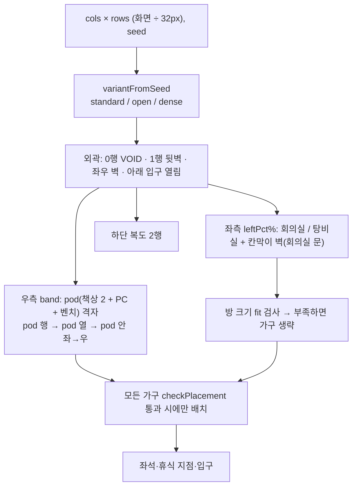

# pixel-agents 가구 에셋과 pixtuoid 레이아웃 규칙

> 2026-09-23 작성. `/demo/pixel-agents-office` 데모의 에셋 출처, manifest 해석 규칙, 배치·이동 제약, 레이아웃 생성 규칙을 정리합니다.

## 에셋 출처와 형식

- 원본: [`pixel-agents-hq/pixel-agents`](https://github.com/pixel-agents-hq/pixel-agents) v1.4.1 (커밋 `3537e14`) `webview-ui/public/assets/`, MIT 라이선스.
- 위치: `public/assets/pixel-agents/` — 원본 디렉터리를 **바이트 단위로 그대로** 복사했고 `LICENSE`만 추가했습니다. 파일을 고치거나 형식을 바꾸지 않습니다.
  - `furniture/<FOLDER>/manifest.json` + PNG (가구 25종)
  - `floors/floor_0..8.png` (16×16 회색조 패턴), `walls/wall_0.png` (64×128, 16×32 조각 4×4), `carpets/`, `characters/`, `pets/`, `default-layout-1.json`
- `characters/char_*.png`는 기존 `public/assets/characters/`와 동일 파일입니다. `Character` 엔티티는 기존 경로를 그대로 씁니다.
- 브라우저는 public 디렉터리를 나열할 수 없으므로 `vite.config.ts`의 `pixelAgentsFurniturePlugin`이 **manifest가 있는 폴더 이름만** `virtual:pixel-agents-furniture`로 노출하고, manifest는 런타임에 fetch합니다. pixel-agents도 브라우저 모드에서 Vite 플러그인으로 같은 일을 합니다.

## manifest 해석 (`src/domain/pixelAgents/manifest.ts`)

- 그룹 트리(`rotation` / `state` / `animation`)를 upstream `flattenManifest`와 같은 규칙으로 평탄화합니다. 레이아웃의 `type`은 **leaf asset id**입니다(`DESK_FRONT`, `PC_FRONT_OFF`).
- `mirrorSide: true`인 `side` 방향 자산은 `<id>:left` 가상 항목을 추가하고, 같은 PNG를 좌우 반전해 그립니다.
- `state: "on"` 애니메이션 그룹은 `getOnAnimationFrames`로 찾습니다. 데모에서는 앉아서 일하는 에이전트의 PC가 `PC_FRONT_ON_1..3`을 200ms 간격으로 순환합니다.

## 배치·이동 제약 (`src/domain/pixelAgents/layout.ts`)

upstream `layoutSerializer.ts`, `editorActions.ts::canPlaceFurniture`, `tileMap.ts`와 같은 의미입니다.

| manifest 필드 | 배치 규칙 (`checkPlacement`) | 이동 규칙 |
|---|---|---|
| `footprintW/H` | 맵 경계 안 | footprint 타일 차단 |
| `backgroundTiles` | 윗 N행은 WALL/VOID 검사와 다른 가구 충돌을 건너뜀 | 윗 N행은 **통과 가능** (책상 뒷줄, 벽 앞 식물 윗부분) |
| `canPlaceOnWalls` | footprint **맨 아래 행만** WALL이어야 함, 윗행은 맵 밖·VOID 허용 | — |
| (그 외) | background 아닌 행이 WALL/VOID에 닿으면 불가 | — |
| `canPlaceOnSurfaces` | `desks` 카테고리 footprint 위는 충돌로 보지 않음 (PC·커피) | z는 받친 책상보다 +0.5 |
| `category: chairs` | — | background 아래 footprint 타일이 **좌석**. 방향은 orientation → 인접 desks → south |

- 보행 가능 = WALL/VOID 아님 AND `getBlockedTiles`에 없음. 좌석은 차단 타일이므로 경로를 찾을 때 **목표 좌석 하나만** 차단에서 뺍니다.
- z 정렬: 가구 `row*16 + spriteH`, 의자는 `(row+1)*16`(등받이 `back`은 footprint 아래 +1), 벽 `(row+1)*16`, 캐릭터는 발 타일 하단 +0.5, 앉을 때 스프라이트만 6px 내림.
- 벽은 4-bit bitmask(N=1, E=2, S=4, W=8, 맵 밖은 벽 아님)로 `wall_0.png` 조각을 고르고 타일 아래에 맞춰 위로 16px 튀어나오게 그립니다.
- 바닥 타일 값 N(1~9)은 `floor_{N-1}.png`이고, 모든 바닥·색 있는 벽은 upstream Photoshop Colorize(지각 휘도 → contrast → brightness → 고정 H/S)로 칠합니다.

## 레이아웃 생성 — pixtuoid 규칙 (`src/domain/pixelAgents/generate.ts`)

[`pixtuoid-resize-relayout.md`](pixtuoid-resize-relayout.md)의 규칙을 pixel-agents 타일에 옮겼습니다. 출력은 pixel-agents `OfficeLayout` 형식(`tiles`, `tileColors`, `furniture`)이라 upstream 에디터·렌더러 형식과 호환됩니다.

- 변형: `standard`(회의실+탕비실, 좌측 38%), `open`(탕비실, 30%), `dense`(회의실, 26%). 좌측 폭이 6타일 미만이면 방을 만들지 않고 책상 구역에 넘깁니다.
- pod: 책상 `DESK_FRONT` 3×2 두 개 + `PC_FRONT_OFF`(책상 윗줄) + `CUSHIONED_BENCH`(책상 아래). 통로는 가로 2칸·세로 1칸, 오른쪽에 반쪽 pod 열 허용.
- 회의실은 폭 7·높이 5 이상일 때만 `TABLE_FRONT` + 좌우 `WOODEN_CHAIR_SIDE(:left)`를 둡니다. 라운지(소파 4종 + 커피 테이블)는 탕비실 폭·높이 6 이상일 때만 둡니다. 부족하면 `room-too-small`로 기록하고 빈 바닥으로 둡니다.
- 벽걸이(그림·시계·책장·화이트보드)는 `canPlaceOnWalls` 규칙으로 뒷벽과 탕비실 윗벽에 겁니다. 규칙 위반은 `skipped`에 사유와 함께 남습니다.

## 리사이즈와 에이전트 (`src/game/pixelAgents/PixelAgentsOfficeScene.ts`)

- 매 프레임 `cols×rows:seed` 시그니처를 비교하고, 바뀌면 `createOfficeLayoutMemo`(최근 1개 memo)로 레이아웃을 받아 다시 그립니다. 실패(null)는 memo를 덮지 않습니다.
- 수용 인원은 `max`로만 갱신합니다. 에이전트는 책상 번호를 유지하고, 줄어든 레이아웃에 자기 책상이 없으면 **숨김**(살아 있음) 상태가 되며, 다시 커지면 나타납니다.
- 재구성 시 이동 경로는 버리고 각자 책상에 앉힙니다(pixtuoid `invalidate_routes`).
- 에이전트 상태는 working(타이핑, PC on) → thinking(앉아 있음) → 45% 확률로 휴식(소파·회의 의자·탕비실·복도로 걸어가 앉거나 섬) → 복귀를 반복합니다.
- 너무 작으면 그리지 않고 패널에 `최소 W×H 타일 필요`를 표시합니다.
- 패널의 "제약 표시"는 차단(빨강)·좌석(초록)·휴식 지점(파랑) 오버레이를 켭니다. 가구가 캐릭터 위로 걸어 다니는 것처럼 보이면 이 오버레이로 footprint·background 행부터 확인합니다.
