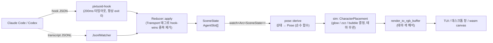
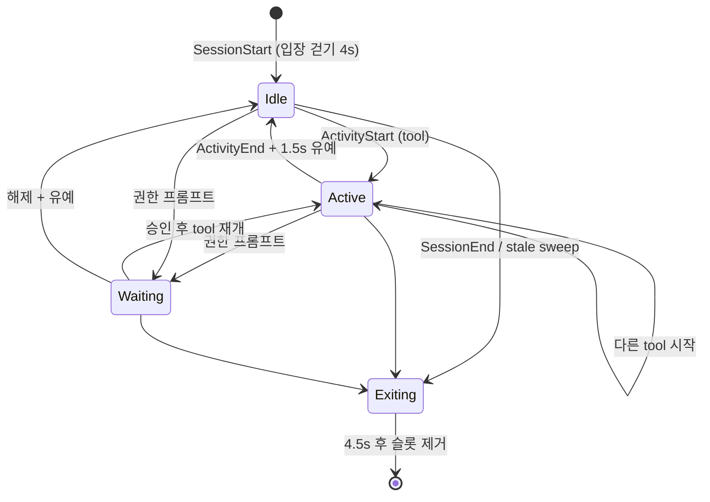

# Pixtuoid의 에이전트 상태 표시 방식

조사일: 2026-09-23 · 대상: [`IvanWng97/pixtuoid`](https://github.com/IvanWng97/pixtuoid) v0.19.0 (커밋 `21b6e44`)

Pixtuoid는 터미널(½-블록 `▀`)·데스크톱 창·브라우저 canvas에 픽셀 아트 오피스를 그려 코딩 에이전트 상태를 보여주는 Rust 프로젝트다. pixel-office와 목표가 같으므로, 상태를 **어떻게 모델링하고 어떤 시각 채널로 표현하는지**를 참고 자료로 정리한다. 경로는 모두 pixtuoid 레포 기준.

## 1. 파이프라인

Cargo 워크스페이스가 `producer → reducer → renderer` 단방향으로 연결된다.



- `pixtuoid-core`: 소스 디코더, FSM, 리듀서. 터미널 의존성 없음.
- `pixtuoid-scene`: 상태 → 포즈 → 픽셀 엔진. 크레이트 경계로 터미널·윈도 의존을 컴파일러가 막는다.
- 리듀서는 변경마다 새 `Arc<SceneState>`를 `watch` 채널로 발행하고, 렌더러는 락 없이 최신 스냅샷을 읽는다.

## 2. 상태 모델 — 활동 상태는 3개뿐

`crates/pixtuoid-core/src/state/mod.rs`

```rust
enum ActivityState {
    Idle,
    Active { tool_use_id, detail, kind: ToolKind }, // Task / Edit / Read / Bash / Search / Other
    Waiting { reason },                             // 권한·입력 프롬프트 대기
}
```

`AgentSlot`은 이 외에 생명주기 필드(`created_at`, `exiting_at`, `pending_idle_at`), 누적 통계(`tool_call_count`, `active_ms`, `tokens_used`), 메타(`model`, `effort`, `parent_id`)를 가진다. **걷기·앉기 같은 포즈는 상태에 넣지 않는다** — 포즈는 렌더 쪽에서 파생된다.



주요 상수 (`crates/pixtuoid-core/src/state/reducer/mod.rs`):

| 상수 | 값 | 의미 |
|---|---|---|
| `ACTIVE_GRACE_WINDOW` | 1.5s | tool 종료 후에도 Active 유지 — 연속 tool 호출 사이 깜빡임 방지 |
| `EXIT_GRACE_WINDOW` | 4.5s | 퇴장 애니메이션 후 슬롯 제거 |
| `STALE_ACTIVE / IDLE / WAITING_TIMEOUT` | 10분 / 30분 / 60분 | 이벤트가 끊긴 슬롯을 1Hz tick에서 정리 |
| `THINKING_WINDOW_SECS` (scene) | 20s | Idle 직후 "생각 중" 포즈 유지 시간 |

- `ToolKind`는 리듀서가 슬롯 진입 시 **한 번만** 도출한다(`ToolKind::from_detail`). 렌더 쪽은 도구 이름 문자열을 재파싱하지 않고 typed `kind`만 본다.
- 서브에이전트는 `parent_id` 스코프 트리로 관리한다: 종료는 아래로 cascade, 생존 신호는 위로 전파.

## 3. 상태 → Pose

`crates/pixtuoid-scene/src/pose/pure.rs` 의 `derive(slot, now, layout)` — 스냅샷 입력만의 순수 함수. 먼저 매칭되는 규칙이 이긴다.

| 우선순위 | 조건 | Pose |
|---|---|---|
| 1 | `exiting_at` 후 4s 이내 | `Walking` 책상 → 문 (이후 `None` = 사라짐) |
| 2 | `created_at` 후 4s 이내 | `Walking` 문 → 책상 (입장) |
| 3 | `Active` | `SeatedTyping { frame }` (140ms × 2프레임) |
| 4 | `Waiting` | `SeatedIdle` |
| 5 | `Idle`, 마지막 이벤트 후 20s 이내 | `SeatedThinking` |
| 6 | `Idle`, 20s 초과 | 배회 사이클: `Walking` / `AtWaypoint`(소파·자판기·회의실) / `AimlessAt` / 졸기 |

- 배회 여부·목적지·체류 시간은 `agent_id` 해시(`personality_for`, `takes_trip`, `dwell_ms`)로 결정 → 에이전트마다 성격이 다르되 결정적이라 스냅샷 테스트가 가능하다.
- 실제 렌더는 A* 라우팅·물리 타이밍을 얹은 `pose/mod.rs::derive_with_routing`을 쓰고, 순수 버전은 오버레이·스냅샷용 근사 타임라인이다.

## 4. Pose → 시각 효과

`crates/pixtuoid-scene/src/pixel_painter/sim.rs` (`resolve_characters`)가 테마와 무관한 결정(`CharacterGlow::{None, Thinking, Tool}`, `sleep_z_seed`, `waiting_bubble`)을 만들고, `pixel_painter/mod.rs::character_glow_tint`가 테마 색으로 해석한다.

| Pose / 상태 | 스프라이트 | 캐릭터 글로우 | 머리 위 이펙트 |
|---|---|---|---|
| `SeatedTyping` (Active) | `typing` | tool 종류별 색 | – |
| `SeatedThinking` | `seated` | 기본 tool 글로우 색 | – |
| `SeatedIdle` + Waiting | `seated` (깨어 있음) | 없음 | 노란 `?` 말풍선 (`effects.rs::paint_waiting_bubble`) |
| `SeatedIdle` (오래 쉼) | `seated_sleeping` / `_alt` | 없음 | 떠오르는 `z` (`paint_sleep_z`) |
| `Walking` | 걷기 | 없음 | 발밑 먼지 |

설계 의도(코드 주석): **Waiting은 사람을 필요로 하는 유일한 상태**이므로 반드시 깨어 있는 자세 + `?` 로 표시하고, 조는 모습(zzz)과 절대 섞지 않는다.

책상과 소품도 상태를 나타낸다.

- **모니터 글로우** — 앉아 있고(`SeatedTyping`/`SeatedThinking`) Active이며 화면이 보이는 북향 책상일 때만 `tool_glow_for_kind()` 색(edit / read / bash / agent / grep / default)으로 칠한다 (`palette.rs:363`). 캐릭터 피부에도 같은 색이 틴트되어 작업 중인 줄이 도구별 색으로 구분된다.
- **대기 화면** — 비어 있거나 쉬는 책상은 어두운 standby 화면.
- **토큰 미터** (`token_meter.rs`) — 누적 fresh 토큰 25만부터 ×8 간격 최대 3단으로 책상 위 종이 더미가 쌓이고, 한 번에 2.5만 토큰 이상 소비하면 종이 한 장이 떨어진다(빈도 = 소비 속도).
- **burn tier** (`burn.rs`) — 최상위 모델이면 붉은 머리, 여기에 신선한(10분 이내) max effort면 불꽃 왕관.
- **커피** — 자판기를 다녀오면 커피를 들고 오고, 책상 컵에서 김이 난다.
- **잡담 말풍선** (`chitchat.rs`) — 같은 휴게 공간에 모인 Idle 에이전트끼리 짧은 대사를 주고받는다(분위기 연출이며 상태 정보는 아님).

## 5. 텍스트 UI 채널

- **이름표** (`overlay.rs`) — `cc·repo` 형식. `LabelTone`(Active / Waiting / Idle / Exiting)으로 테마 색 결정, 접두사(`cc`, `cx` …)는 소스별 배지 색. 라벨 충돌 시 session_id 해시 접미사로 구분. 스프라이트 위에 떠서 이동을 따라간다.
- **푸터** (`footer.rs`) — 층별 상태 카운트를 `● Active / ◐ Waiting / ○ Idle / ◌ Exiting` 글리프 + 단어(좁으면 한 글자)로 표시. 색에만 의존하지 않도록 글리프가 1차 채널. 소스 연결이 끊겨 경고 줄로 바뀌어도 `▲N need you` 는 남긴다.
- **호버 툴팁** (`crates/pixtuoid/src/tui/widgets/tooltip.rs`) — 한 에이전트의 상세 정보:
  - `● Active · Edit` (도구명에 tool 글로우 색) 또는 `◐ Waiting` + `?reason`
  - tool detail(파일 경로 등), `↳ under <부모>`, cwd, `★ model · effort`
  - `◷ 세션 시간 · N calls · Σ 토큰 · ▮▮▯▯▯ 활동 비율%`
  - Exiting이면 남아 있는 Active/Waiting payload를 숨긴다.

## 6. pixel-office와 비교

현재 pixel-office의 도메인 모델(`src/domain/agent.ts`, `src/domain/mapping.ts`):

```ts
type AgentStatus = 'idle' | 'walking' | 'typing' | 'sitting' | 'thinking' | 'offline';
```

| 관점 | pixtuoid | pixel-office 현재 |
|---|---|---|
| 상태 축 | 활동 상태(3) 와 포즈를 분리, 포즈는 파생 | 활동(`typing`, `thinking`)과 포즈(`walking`, `sitting`)가 한 enum에 섞임 |
| 권한 대기 | `Waiting { reason }` + `?` 말풍선 + 카운터 | 해당 상태 없음 |
| 도구 종류 | `ToolKind` → 모니터·캐릭터 글로우 색, 툴팁 색 | 없음 |
| 깜빡임 억제 | 1.5s Active 유예, 20s thinking 창 | 없음(이벤트가 곧 상태) |
| 생명주기 | 입장·퇴장 걷기, stale 타임아웃 | `offline` 은 즉시 `visible: false` |
| 부가 정보 | 토큰 더미, burn tier, 툴팁 통계 | `message` 말풍선 |

## 7. 적용 시 고려할 점

1. **상태 축 분리** — `AgentStatus` 를 활동 상태(`idle | active | waiting`) + tool kind 로 줄이고, walking/sitting/thinking 같은 포즈는 `mapping.ts` 쪽에서 시간과 자리 정보로 파생한다. pixtuoid의 `derive` 우선순위 표가 그대로 참고가 된다.
2. **Waiting을 최우선으로 강조** — 관찰 도구의 핵심 신호다. 캐릭터 이펙트와 전역 카운터(`N need you`)를 함께 둔다.
3. **시간 기반 디바운스** — tool 호출 사이 1.5s, thinking 20s 같은 창이 없으면 ~100 에이전트 규모에서 화면이 계속 깜빡인다.
4. **결정적 개인차** — 배회·체류·좌석 변형을 `agentId` 해시로 정하면 재현성과 테스트 용이성이 생긴다.
5. **테마 무관 결정 / 색 해석 분리** — sim이 `CharacterGlow::Tool` 같은 추상 결정을 내고 렌더 레이어가 색을 입히는 구조는 `domain` ↔ `game` 레이어 경계([`architecture.md`](architecture.md))와 잘 맞는다.
6. **색 이외 채널** — 글리프·단어를 함께 써서 색약 사용자도 상태를 구분할 수 있게 한다.
