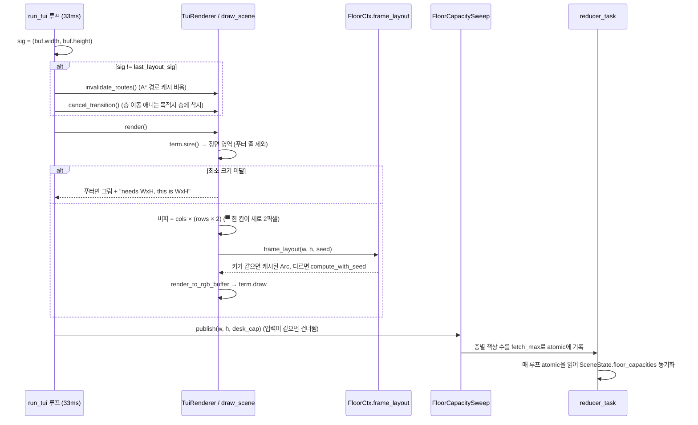
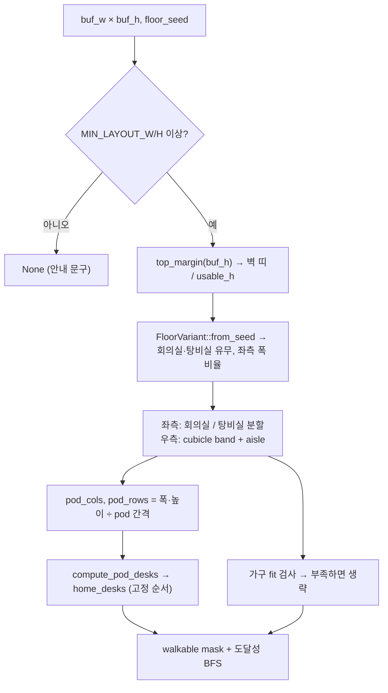

# Pixtuoid의 리사이즈 감지와 오피스 레이아웃 재계산

조사일: 2026-09-23 · 대상: [`IvanWng97/pixtuoid`](https://github.com/IvanWng97/pixtuoid) v0.19.0 (커밋 `21b6e44`) · 관련 문서: [`pixtuoid-agent-status-display.md`](pixtuoid-agent-status-display.md)

터미널(또는 데스크톱 창) 크기가 바뀔 때 Pixtuoid가 오피스 레이아웃을 다시 만드는 방식을 정리한다. 경로는 모두 pixtuoid 레포 기준.

## 요약

- `Event::Resize` 이벤트를 쓰지 않는다. 33ms 프레임 루프가 **매 프레임 `term.size()`를 읽고**, 버퍼 크기 시그니처가 바뀌었는지 비교해 감지한다.
- 레이아웃은 `(buf_w, buf_h, floor_seed)`의 **순수 함수**이고, 이 키로 **1개짜리 memo**에 캐시한다. 크기가 바뀌면 키가 달라져 자연히 재계산된다.
- 크기 변화 시 추가로 하는 일은 A* 경로 캐시 비우기와 층 이동 애니메이션 종료뿐이다.
- 층별 책상 수(수용 인원)는 `fetch_max`로 **늘기만 하고 줄지 않는다** — 창을 줄여도 좌석이 재배정되지 않는다.

## 1. 한 프레임의 흐름



## 2. 크기 변화 감지 — `crates/pixtuoid/src/tui/mod.rs:962`

```rust
let sig = (renderer.buf().width(), renderer.buf().height());
if last_layout_sig != Some(sig) {
    renderer.invalidate_routes();   // 층마다 router.invalidate() → paths.clear()
    renderer.cancel_transition();   // 사용자의 층 이동은 취소하지 않고 목적지 층에 착지
    last_layout_sig = Some(sig);
}
```

- 이벤트 방식이 아니라서 이벤트 누락, 연속 리사이즈 폭주, 그리기 도중 크기 변경을 한 경로로 처리한다.
- `draw_scene`은 `term.size()`와 `term.draw()` 사이에 크기가 또 바뀌는 경우를 막으려고 `f.area()`에서 영역을 다시 구한다 (`tui/renderer.rs:388`).
- 최소 크기 미달이면 빈 화면 대신 푸터와 `needs WxH, this is WxH` 안내를 그린다 (`tui/renderer.rs::paint_too_small_notice`). 층 이동 중이었다면 이 경로에서도 `cancel_transition()`을 호출해 슬라이드가 멈춰 보이지 않게 한다.

## 3. 레이아웃 캐시 — `crates/pixtuoid-scene/src/floor/mod.rs:162`

```rust
let key = (buf_w, buf_h, floor_seed);
match &self.layout_memo {
    Some((k, l)) if *k == key => Arc::clone(l),
    _ => { let l = Arc::new(Layout::compute_with_seed(buf_w, buf_h, None, floor_seed)?);
           self.layout_memo = Some((key, Arc::clone(&l))); l }
}
```

- 최근 1개만 캐시한다. 적중하면 `Arc`를 공유해 깊은 복사가 없다.
- 크기가 너무 작아 `None`이 나와도 기존 memo를 지우지 않는다 (`floor/tests.rs::frame_layout_memo_matches_fresh_compute_across_hits_resizes_and_none`).
- 터미널·데스크톱 창·웹 canvas가 모두 이 함수로 레이아웃을 얻는다.
- 호출할 때마다 router에 새 레이아웃의 corridor를 선호 구역으로 알려주고, 구역이 달라지면 경로 캐시도 비운다.

## 4. 레이아웃 계산 — `crates/pixtuoid-scene/src/layout/compute.rs:164`

`compute_with_seed(buf_w, buf_h, max_desks, floor_seed)`는 크기와 seed만으로 결정되는 순수 함수다.



- **최소 크기**: `MIN_LAYOUT_W/H`는 "책상 1개가 들어가는 크기"에서 `const fn`으로 역산한다. 안내 문구의 `needs WxH`와 시작 시 수용 인원 계산도 같은 값을 쓴다 (`tui/renderer.rs::min_terminal_size`, `runtime/mod.rs::capacity_for_terminal`).
- **좌/우 분할**: 층 seed로 정한 `FloorVariant`가 좌측 방(회의실·탕비실) 폭 비율을 정하고, 나머지가 책상 구역(`band_w`)이다. 탕비실 카운터는 폭이 충분하면 큰 스프라이트, 아니면 작은 스프라이트.
- **책상 배치** (`compute_pod_desks`): 2×2 pod를 pod 행 → pod 열 → pod 내부 행·열 순으로 채운다. 순서가 고정이라 창을 키워도 앞번호 책상 위치는 규칙적으로 유지되고 뒤쪽에 책상이 추가된다. 구역을 벗어나는 책상은 넣지 않는다.
- **축소 시 가구 생략**: 회의실 폭이 30 미만이면 소파 세트를 빼고 빈 바닥으로 둔다(경로를 못 찾아 캐릭터가 순간이동하는 것을 막기 위함). 엘리베이터 문도 공간이 없으면 생략한다.
- **확대 시 여유 공간**: 높이 60 이상부터 소파와 책상 사이 간격이 `(buf_h - 60) / 20`만큼 넓어진다.

## 5. 수용 인원 반영

- `FloorCapacitySweep::publish` (`crates/pixtuoid/src/tui/mod.rs:303`): 층마다 전체 레이아웃을 한 번씩 계산해 `home_desks.len()`만 취한다. 비용이 커서 `(w, h, desk_cap)`가 같으면 건너뛴다.
- **`fetch_max`로 단조 증가**: 줄이면 층별 책상 번호 오프셋이 밀려 2층 이상 에이전트가 엉뚱한 책상으로 옮겨지기 때문이다.
- `reducer_task` (`crates/pixtuoid/src/runtime/driver.rs:185`)가 매 루프 atomic을 읽어 `SceneState.floor_capacities`에 반영하고, 새 에이전트의 `next_free_desk()`가 이를 쓴다.
- 에이전트는 전체 공용 책상 번호(`GlobalDeskIndex`)만 가지고, 층·층 내 번호는 현재 수용 인원의 누적 오프셋으로 매번 계산한다 (`crates/pixtuoid-core/src/state/mod.rs:694`).
- 창을 줄여 새 레이아웃에 없는 책상 번호를 가진 에이전트는 **보이지 않을 뿐 살아 있고**, 창을 다시 키우면 나타난다 (`crates/pixtuoid/src/floating/offscreen.rs:172`).
- 시작 시 첫 수용 인원은 `capacity_for_terminal(cols, rows)`로 정한다 (`crates/pixtuoid/src/runtime/mod.rs:132`).

## 6. 데스크톱 창 — `crates/pixtuoid/src/floating/window.rs:361`

- `WindowEvent::Resized`에서는 `request_redraw()`만 한다.
- 실제 재계산은 TUI와 같은 `frame_layout` memo와 수용 인원 경로(`floating/offscreen.rs:193`)를 거친다. 즉 창 모드도 "크기 비교 → memo 재계산" 원칙을 공유한다.

## 7. pixel-office에 적용할 때 고려할 점

1. **이벤트 말고 크기 비교로 감지** — Phaser `scale.resize` 이벤트를 받더라도 실제 재구성은 "크기 키가 바뀌었는가"로 판단한다. 연속 리사이즈 중 매 이벤트마다 재구성하지 않게 된다.
2. **레이아웃은 `(w, h, seed)`의 순수 함수 + memo** — 원래 크기로 되돌리면 같은 오피스가 나오고, 스냅샷 테스트가 쉽다. 현재 pixel-office는 Tiled 맵 기반이므로([`tiled-schema.md`](tiled-schema.md)) 절차적 생성을 그대로 가져오기보다 "크기별 맵 변형 선택 또는 영역 확장" 규칙을 순수 함수로 두는 방향이 맞다.
3. **책상 순서 고정 + 수용 인원 비감소** — 창을 줄여도 좌석이 재배정되지 않는다. ~100 에이전트 규모([`project-constraints.md`](project-constraints.md))에서 좌석이 뒤섞이지 않게 하는 핵심이다.
4. **크기 변화 시 경로 캐시만 무효화** — 이동 중인 캐릭터는 다음 경로 요청 때 새 지형 기준으로 재탐색한다. 동적 장애물·경로 재계산 규칙은 [`phaser-depth-and-pathfinding-notes.md`](phaser-depth-and-pathfinding-notes.md)와 맞춘다.
5. **공간이 부족하면 가구를 생략** — 좁은 방에 가구를 억지로 넣어 경로가 끊기는 것보다 빈 바닥이 낫다.
6. **최소 크기 미달이면 이유를 표시** — 빈 캔버스 대신 필요한 크기를 알려준다.
