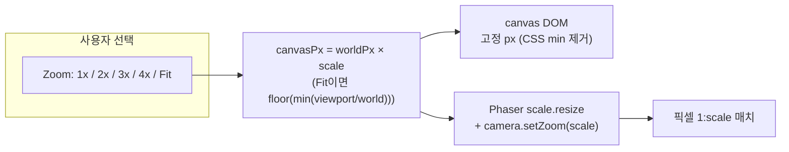

# Pixel Match Zoom 구현 계획

> 2026-04-22 작성. 현재 상태 및 배경은 [`../canvas-rendering.md`](../canvas-rendering.md) 참고.

## 목표

사용자가 게임 캔버스를 **"원본 타일 픽셀 : 화면 픽셀"의 정확한 정수 비율**(1:1, 1:2, 1:3, 1:4, Fit)로 직접 선택할 수 있게 한다. 어느 단계에서도 브라우저 CSS가 캔버스를 비정수로 스케일하지 못하도록 차단한다.

### 비목표

- 줌/팬(사용자가 드래그로 월드를 이동) — 이번 범위 아님.
- 비정수 줌(1.5x 등) — 픽셀 아트 원칙상 금지.

## 설계 컨셉

"Canvas 크기 × Aspect" 2축을 **"Zoom 배율" 단일 축**으로 대체한다. 캔버스 DOM 크기는 `worldPx × scale`로 고정하고, CSS에서는 `min()`으로 축소하지 않는다.

## 결정 필요 사항

아래 두 항목은 구현 전에 사용자 확인 필요.

1. **툴바 축**
   - A) 현재 "Small/Medium/Large + Aspect" 축을 제거하고 **Zoom 단일 축**으로 교체.
   - B) Aspect 축은 유지하고 Zoom 축을 병기.
2. **캔버스가 창보다 커질 때 정책**
   - A) 스크롤 허용 — 가장 단순, 픽셀 매치 유지.
   - B) 자동 Fit 강등 + UI 알림 배지.
   - C) 카메라 보기 범위만 축소(클리핑) — 월드 일부만 노출.

## 작업 단계

### 1. 도메인/상수 정리

- `src/domain/view.ts`(신규) 또는 기존 `domain/office.ts`에 `ViewZoom = 1 | 2 | 3 | 4 | 'fit'` 타입 추가.
- `src/game/tiled/loader.ts`에 `getMapPixelSize(mapKey)` 또는 `createPhaserTilemap` 리턴에 `worldWidth/worldHeight` 노출(현재 Scene 내부에서만 계산).
- `src/bridge/gameBus.ts`에 이벤트 추가:
  - `'ui:zoom-changed': { scale: ViewZoom }`

### 2. React 쪽 — `src/game/PhaserGame.tsx`

- `sizeOptions` / `aspectOptions`를 결정 A에 따라 정리, `zoomOptions = [{id:'1', scale:1}, {id:'2', scale:2}, ...]`로 교체/병기.
- `useCanvasSize`를 `useCanvasPixelSize(zoom, worldPx)`로 변경 → `zoom === 'fit' ? auto : worldPx × zoom`.
- 툴바에 **현재 배율 + 산출 크기**(예: `Pixel 1:3 (960×528)`) 표기.
- zoom 변경 시 `gameBus.emit('ui:zoom-changed', { scale })` 호출.
- 월드 크기는 gameBus `'game:ready'`에서 받거나, loader에서 import한 메타 사용.

### 3. CSS — `src/App.css:9-19`

- `.phaser-host`에서 `width: min(var(--canvas-width), 100vw)` / `height: min(..., 100vh)` 제거 → `width: var(--canvas-width)` / `height: var(--canvas-height)`로.
- 창 초과 시 정책(결정 2)에 따라 `overflow`, `max-width/max-height`, 또는 부모 컨테이너 처리 추가.

### 4. Scene — `src/game/scenes/OfficeScene.ts`

- `getIntegerZoom`을 Fit 경로 전용으로 남기고, 일반 경로는 `camera.setZoom(userScale)`.
- `userScale`은 `scene.registry` 또는 `gameBus` 이벤트로 주입. 초기값은 registry에서 읽고, 변경은 `'ui:zoom-changed'` 구독으로 `camera.setZoom(scale)` + `camera.centerOn(worldW/2, worldH/2)` 재호출.
- `handleResize`는 Fit 모드일 때만 재계산하도록 분기.
- **주의**: `scene.restart` 호출은 피한다. (타일셋 변경 경로만 restart 유지.)

### 5. 리사이즈/부착 흐름

- 현재 `ResizeObserver`(`PhaserGame.tsx:51-55`)가 `game.scale.resize(viewportW, viewportH)`를 호출함. Zoom 선택이 있을 때는 부모 `.phaser-host`의 크기가 이미 고정되므로 ResizeObserver는 트리거되지 않지만, Fit 모드에서는 계속 필요.
- `.phaser-host`의 크기는 React state(`zoom`, `worldPx`)에 의해 결정되므로 ResizeObserver와 충돌 없음.

### 6. HiDPI 점검

- `devicePixelRatio = 2`인 Retina에서 `pixelArt: true` + `roundPixels: true`가 nearest-neighbor로 유지되는지 dev 환경에서 시각 확인.
- 필요 시 `render.resolution` 또는 `canvas.style` vs `canvas.width` 분리 처리 고려.

### 7. 데모 라우트 반영

- `src/ui/Demo*.tsx` 라우트들이 `PhaserGame`을 공유/분기하는지 확인(현재 `src/App.tsx`, `src/ui/demoRoutes.ts` 기준).
- 공유라면 자동 반영. 독립 구현이면 같은 `ViewZoom` 도입.

### 8. 검증 (시각 확인)

자동화 테스트가 없으므로 `npm run dev`로 육안 확인.

- [ ] 1x: 캔버스 320×176 — 작은 게임 창, 블러 없음.
- [ ] 2x: 캔버스 640×352 — 블러 없음, 중앙 정렬.
- [ ] 3x: 캔버스 960×528 — 블러 없음.
- [ ] 4x: 캔버스 1280×704 — 블러 없음.
- [ ] Fit: 창 크기 변경 시 정수 줌 유지 + 중앙 정렬.
- [ ] 창이 캔버스보다 작을 때 정책(결정 2)이 의도대로 동작.
- [ ] 타일셋 변경 시에도 현재 zoom 유지(`scene.restart` 후 registry에서 복원).

## 예상 파일 변경 범위

| 파일 | 변경 내용 |
|---|---|
| `src/domain/*.ts` | `ViewZoom` 타입 추가 |
| `src/bridge/gameBus.ts` | `'ui:zoom-changed'` 이벤트 추가 |
| `src/game/tiled/loader.ts` | 월드 픽셀 크기 노출 |
| `src/game/PhaserGame.tsx` | 툴바 재구성, canvas 크기 계산 변경, zoom 주입 |
| `src/game/scenes/OfficeScene.ts` | 카메라 줌 소스 변경, Fit 분기 |
| `src/App.css` | `.phaser-host`의 `min()` 제거, 정책에 따른 overflow 처리 |
| `src/ui/Demo*.tsx` | (공유 여부에 따라) zoom 토글 반영 |

## 오픈 이슈

- 툴바 UX 상세(아이콘? 배지? 키보드 단축키 +/- ?)는 결정 1에 따라 이어서 설계.
- 모바일(좁은 세로 화면)에서는 대부분 1x 또는 2x가 한계. 기본값을 `fit`으로 유지하는 것이 안전.
