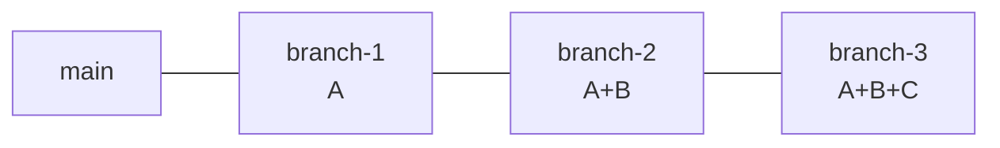

# Stacked PR 충돌 방지 가이드

> 2026-04-22 작성. v2 마이그레이션에서 반복적으로 마주친 "squash merge + stacked PR" 충돌 문제의 근본 원인과 대응 전략을 정리합니다. 앞으로 스택 워크플로우가 필요할 때 이 문서를 먼저 참고합니다.

## 근본 원인: squash merge + chained branches



- `branch-2`, `branch-3`은 `branch-1`의 **원본 커밋**을 그대로 포함합니다.
- `branch-1`을 **squash 머지**하면 main에는 A 내용을 가진 **새 커밋 하나**가 생깁니다.
- `branch-2`의 히스토리에는 여전히 A의 **원본 커밋**이 남아 있어, main과 rebase하면 "이미 들어간 변경을 다시 적용"하려다 **충돌**합니다.

v2 스택에서 매 머지 직후 하위 PR이 모두 `mergeable=CONFLICTING, mergeStateStatus=DIRTY`로 전환된 이유가 정확히 이 구조입니다.

## 대응 전략

### 1. `git rebase --onto` 로 베이스 교체 후 force push (권장 기본기)

각 하위 PR을 머지할 때마다 바로 다음 PR 브랜치를 재정렬합니다.

```bash
git fetch origin main
git checkout branch-2
git rebase --onto origin/main branch-1 branch-2
git push --force-with-lease
```

- `--onto origin/main`: 새 base
- `branch-1`: 잘라낼 이전 부모 (원래 base)
- `branch-2`: 재배치할 대상

이 조합이 squash된 A를 자동으로 건너뛰고 B만 남깁니다. 매 머지마다 반복합니다.

### 2. 로컬 헬퍼 스크립트로 체인 자동화

`.bashrc` / `.zshrc` 또는 `scripts/restack.sh`에:

```bash
restack() {
  local new_base=$1; shift
  local prev=$new_base
  for branch in "$@"; do
    git rebase --onto $new_base $prev $branch
    prev=$branch
  done
}
# 사용 예: restack origin/main branch-1 branch-2 branch-3
```

순서대로 돌면서 각 브랜치의 base를 새 main 위로 교체합니다. 오류 발생 시 중단되므로 수동 개입 후 이어가기 쉬움.

### 3. GitHub CLI 기반 도구 사용

- **`gh-stack`, `ghstack`(Meta), `git-branchless`**: stacked PR 전용 CLI. 각자 방식은 다르지만 공통 원리는 "다음 브랜치의 base를 자동으로 origin/main으로 재정렬 + force push".
- **`graphite.dev`** (상용): PR을 스택으로 관리하고 머지 시 자동 restack. Web UI와 CLI 제공.
- **Sapling (Meta 오픈소스)**: 스택 기반 Git 대체 클라이언트.

1인 프로젝트 규모에선 위 도구 도입이 과할 수 있고, 전략 1·2 조합이면 충분합니다.

### 4. 머지 전략을 squash 외로 변경

- **`gh pr merge --rebase`**: 원본 커밋이 그대로 main에 들어감 → 하위 브랜치의 rebase가 깔끔히 재생. 단점은 기능 단위 단일 커밋이 아닌 세부 커밋이 여럿 남아 히스토리가 지저분해질 수 있음.
- **`gh pr merge --merge` (merge commit)**: 원본 커밋 + merge commit. 하위 브랜치는 `git pull origin main`만으로 정합 가능. 단점은 main 히스토리가 그래프형으로 복잡해짐.

**squash의 깔끔한 커밋 히스토리**가 우선이면 전략 1·2, **부담 없는 자동 정합성**이 우선이면 전략 4를 택합니다.

### 5. 스택을 짧게 유지

- 한 번에 stacked PR **3개 이하**로 제한.
- 가능한 범위에서 **독립 PR(평행 PR)** 로 기능을 쪼갭니다.
- 스택이 길어질수록 restack 비용이 선형이 아닌 체인 구조로 커지므로, 의존성이 없다면 분리하는 편이 비용이 낮습니다.

## 이번 프로젝트에서의 권장 조합

1. **평소에는 독립 PR**로 기능을 쪼갠다.
2. **스택이 꼭 필요할 때**는 3개 이하로 제한하고, 각 머지 직후 `git rebase --onto origin/main <이전 head> <다음 head>` + `--force-with-lease`로 다음 브랜치를 재정렬한다.
3. **머지 방식**은 `gh pr merge --squash --delete-branch`를 유지한다(히스토리 가독성 우선).
4. **자동화가 필요해지면** `scripts/restack.sh` 추가 → 그래도 부족하면 `gh-stack` 등 경량 도구 도입.

## 주의점: `--delete-branch` 와 stacked PR

- `gh pr merge --squash --delete-branch` 는 머지 후 head 브랜치를 삭제합니다.
- 만약 다른 PR이 이 head(또는 base)를 참조하고 있으면 GitHub가 그 PR을 **자동 close**(재오픈 시에도 base가 없어 실패) 시킵니다.
- stacked PR의 중간 브랜치를 삭제하기 전에는 하위 PR들이 base를 다른 곳으로 옮겼는지(자동 재타겟 또는 수동 `gh pr edit --base`) 반드시 확인합니다.

## 참고 사례: v2 스택 머지 기록

- 2026-04-21: PR #17, #18 순차 머지 → #19~#23 전원 DIRTY로 전환. #20은 base 삭제 여파로 자동 close (#32로 재오픈·머지).
- 2026-04-22: 반복 rebase → 머지 사이클로 PR #19~#31까지 모두 반영 완료.
- 교훈: 초반부터 `restack` 스크립트 또는 `--onto` 명령을 매 머지마다 적용했다면 두 번째 날까지 끌 필요 없었음.
