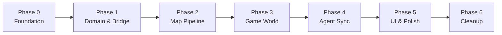
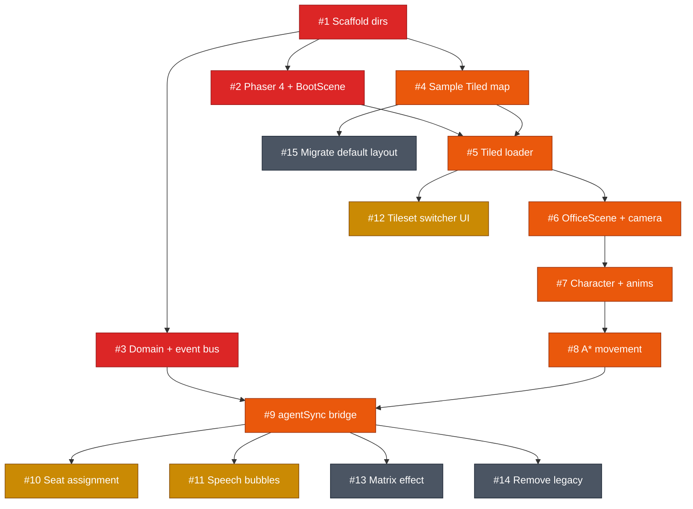
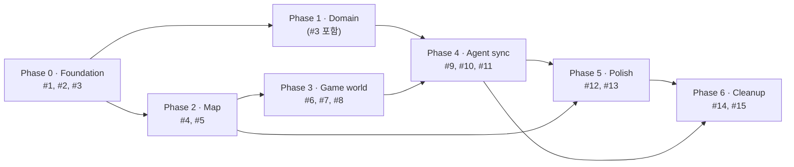

# v2 작업 가이드 (Work Guide)

> 2026-04-21 작성, 2026-04-22 업데이트. Phaser 4 + Tiled 기반 전면 재작성의 권장 작업 순서와 우선순위입니다. GitHub 이슈 등록의 원본이 되는 문서이므로, 범위·기준이 바뀌면 여기를 먼저 업데이트합니다.

## 진행 상황 (2026-04-22 기준)

| # | 상태 | PR | 비고 |
|---|---|---|---|
| 1 | 완료 | #17 | v2 디렉토리 스캐폴딩 머지 |
| 2 | 완료 | #18 | Phaser 4 + BootScene 부트스트랩 |
| 3 | 완료 | #19 | Domain 타입 + gameBus |
| 4 | 완료 | #20 → #32 | 샘플 Tiled 맵 + `memory/tiled-schema.md` (stacked 충돌 여파로 #32로 대체 머지) |
| 5 | 완료 | #21 | Tiled 로더 + tileset variants |
| 6 | 완료 | #22 | OfficeScene + 픽셀 퍼펙트 카메라 |
| 7 | 완료 | #23 | Character entity |
| 8 | 완료 | #24 | PathfindingSystem |
| 9 | 완료 | #25 | agentSync 브릿지 |
| 10 | 완료 | #26 | SeatAssignmentSystem |
| 11 | 완료 | #27 | SpeechBubble + SocialSystem |
| 12 | 완료 | #28 | TilesetSwitcher UI |
| 13 | 완료 | #29 | MatrixEffect |
| 14 | 완료 | #30 | 레거시 `src/office/**` 제거 |
| 15 | 완료 | #31 | `default-layout.json` 제거 + README 업데이트 |

**후속 이슈**: 2026-04-22 계획 대비 점검에서 발견된 미완 항목은 `memory/v2-gaps.md` 참고.

## 전제

- 브랜치: `v2`
- 엔진: Phaser 4.0 "Caladan" (`memory/engine-research.md` 참고)
- 구조: `memory/architecture.md`의 3레이어 + domain 허브
- 목표 불변: **코딩 에이전트 상태 시각화** (`memory/project-goal.md`)
- 규모/배포: ~100 에이전트, 웹→Tauri/Electron 가능 (`memory/project-constraints.md`)

## 전체 단계 개요



## 우선순위 체계

- **P0 (Critical)**: 이 단계가 끝나야 다음 작업이 시작 가능. 직렬 의존.
- **P1 (Core)**: 제품의 본질 기능. 없으면 목표 달성 불가.
- **P2 (Important)**: 제품 완성도/UX. 핵심 파이프라인이 돈 뒤에 착수.
- **P3 (Nice-to-have)**: 정리/이관/부가 효과. 일정 여유가 있을 때.

## 이슈 목록

| # | 우선순위 | 제목 | Phase | 의존 |
|---|---|---|---|---|
| 1 | P0 | 디렉토리 스캐폴딩 (app/host/domain/bridge/game/ui/shared) | 0 | — |
| 2 | P0 | Phaser 4 도입 및 최소 BootScene 부트스트랩 | 0 | #1 |
| 3 | P0 | Domain 타입과 이벤트 버스 정의 | 1 | #1 |
| 4 | P1 | 샘플 Tiled 맵(.tmj) 제작 및 네이밍 규약 문서화 | 2 | #1 |
| 5 | P1 | Tiled 맵 로더 구현 (multi-tileset 지원) | 2 | #2, #4 |
| 6 | P1 | OfficeScene + 픽셀 퍼펙트 카메라 | 3 | #5 |
| 7 | P1 | Character 엔티티 + 걷기/idle/타이핑 애니메이션 | 3 | #6 |
| 8 | P1 | A* 이동 시스템 (easystarjs 또는 자체 포팅) | 3 | #7 |
| 9 | P1 | agentSync 브릿지: AgentEvent → Character 상태 머신 | 4 | #3, #8 |
| 10 | P2 | 좌석 배정 및 좌석 인식 경로 탐색 | 4 | #9 |
| 11 | P2 | Social speech bubble 포팅 | 4 | #9 |
| 12 | P2 | Tileset variant 스위처 UI | 5 | #5 |
| 13 | P3 | Matrix spawn/despawn 효과 포팅 | 5 | #9 |
| 14 | P3 | 레거시 코드 제거 (기존 에디터/Canvas 렌더러) | 6 | #9 |
| 15 | P3 | 기존 default-layout.json의 Tiled 이관 또는 폐기 | 6 | #4 |

## 의존 그래프



색상 범례: 🟥 P0 (Critical) · 🟧 P1 (Core) · 🟨 P2 (Important) · ⬛ P3 (Nice-to-have)

## Phase 요약



## 핵심 경로 (Critical Path)

병목이 되는 최장 의존 체인:

```
#1 → #2 → #5 → #6 → #7 → #8 → #9 → #10 / #11 / #14
```

즉 **#1~#9까지는 가능한 한 직렬로 빠르게 통과**하는 것이 전체 일정에 유리합니다. #3(domain)과 #4(Tiled 샘플)는 #1 직후부터 #2와 병렬로 진행 가능합니다.

## 작업 상세

### #1 [P0] 디렉토리 스캐폴딩
`src/` 아래에 `app/`, `host/`, `domain/`, `bridge/`, `game/`, `ui/`, `shared/` 디렉토리를 생성하고 각 디렉토리에 `index.ts` placeholder만 둡니다. `memory/architecture.md`와 구조가 일치해야 합니다. 기존 `src/office/`는 이 단계에서는 유지하되, 새 디렉토리로 점진 이관 대상.
**검증**: 디렉토리 트리가 architecture.md와 동일.

### #2 [P0] Phaser 4 도입 및 최소 BootScene
`phaser` npm 설치, `src/game/PhaserGame.tsx`에서 React ref에 `Phaser.Game` 부착. 빈 검은 화면 + FPS 표시 정도의 `BootScene.ts` 추가. `App.tsx`에서 `<PhaserGame />`을 렌더링해 페이지에 게임 캔버스가 뜨는지 확인.
**검증**: `npm run dev` 실행 후 검은 캔버스가 브라우저에 렌더링되고 FPS 표시.

### #3 [P0] Domain 타입과 이벤트 버스 정의
`domain/agent.ts`(Agent, AgentStatus), `domain/office.ts`(Office, Seat, TilesetVariant), `domain/events.ts`(AgentEvent union), `domain/mapping.ts`(상태 매핑 순수 함수) 작성. `bridge/gameBus.ts`에 mitt(또는 동등) 기반 이벤트 버스 구현. React/Phaser 의존성 금지.
**검증**: `domain/*` 단위 테스트(또는 최소 타입 체크) 통과, `bridge/gameBus.ts`가 양방향 subscribe 가능.

### #4 [P1] 샘플 Tiled 맵 제작 및 네이밍 규약 문서화
Tiled에서 20×11 기본 오피스 맵 1개, tileset 변형 2개(예: warm / dark) 제작. `public/maps/sample.tmj` 및 `public/tilesets/<variant>.png` 배치. Object layer로 좌석/스폰 지점 표기. `memory/tiled-schema.md` 문서 신설: tileset 이름, tile property, object layer/object name 규약 명시.
**검증**: Tiled에서 열리고, 샘플 맵/타일셋 파일이 `public/` 아래 존재.

### #5 [P1] Tiled 맵 로더 (multi-tileset 지원)
`game/tiled/loader.ts`: `.tmj` JSON을 Phaser `Tilemap`으로 변환. `game/tiled/tilesetVariants.ts`: 같은 맵에 대해 여러 tileset 이미지를 교체 로드. `domain/office.ts`의 Office 타입을 이 로더 결과로 생성.
**검증**: 샘플 맵을 OfficeScene에 로드해 tileset 교체 시 즉시 시각 변화.

### #6 [P1] OfficeScene + 픽셀 퍼펙트 카메라
`game/scenes/OfficeScene.ts`: Tiled 맵 표시 + 카메라 설정(NEAREST, roundPixels, zoom 정수배). 현재 캐릭터 없이 맵만 표시.
**검증**: 맵이 픽셀 선명하게 렌더링, 브라우저 리사이즈 시 스케일 유지.

### #7 [P1] Character 엔티티 + 스프라이트 애니메이션
`game/entities/Character.ts`: Phaser `Sprite` 래퍼. walk(4방향) / idle / type 애니메이션. 기존 `public/assets/characters/` 스프라이트 재사용.
**검증**: 테스트 씬에서 상태 전환 시 애니메이션 전환 확인.

### #8 [P1] A* 이동 시스템
`game/systems/PathfindingSystem.ts`: `easystarjs` 도입 또는 기존 `src/office/layout/tileMap.ts`의 A*를 이식. Tiled 맵의 walkable 타일 정보를 이용.
**검증**: Character가 임의 두 타일 사이를 장애물 피해 이동.

### #9 [P1] agentSync 브릿지: AgentEvent → Character 상태 머신
`bridge/agentSync.ts`: host에서 올라온 AgentEvent를 구독하고 OfficeScene의 Character에 상태 반영. 새 에이전트 생성/제거/상태 변경 처리.
**검증**: 모의 AgentEvent를 방출해 화면의 캐릭터가 대응해 움직이고 상태 변화.

### #10 [P2] 좌석 배정 및 좌석 인식 경로
Tiled object layer의 seat 정보를 `domain/office.ts`의 Seat로 로드, 에이전트에 좌석 배정 규칙 작성. 좌석 도착 시 Sitting 상태로 전환.
**검증**: 에이전트가 빈 좌석을 찾아 앉고, 활성화 시 타이핑 애니메이션.

### #11 [P2] Social speech bubble 포팅
기존 social bubble 로직을 `game/systems/SocialSystem.ts`와 `game/entities/SpeechBubble.ts`로 이식.
**검증**: 이웃한 에이전트 간 대화 버블이 간헐적으로 표시.

### #12 [P2] Tileset variant 스위처 UI
`ui/TilesetSwitcher/`: 드롭다운/버튼 UI에서 변형 선택 시 `bridge`를 통해 현재 맵의 tileset 교체.
**검증**: UI에서 선택 변경 시 즉시 오피스 테마 교체, 페이지 리로드 불필요.

### #13 [P3] Matrix spawn/despawn 효과 포팅
기존 `matrixEffect.ts`의 시각 효과를 Phaser Shader 또는 Tween 기반으로 재구현.
**검증**: 에이전트 등장/퇴장 시 matrix 효과 재생.

### #14 [P3] 레거시 코드 제거
`src/office/editor/`, `src/office/engine/`, 기존 Canvas 렌더러 관련 코드를 삭제. 관련 React hook/컴포넌트도 정리.
**검증**: `git grep`으로 레거시 참조 0건, 앱 정상 동작.

### #15 [P3] default-layout.json의 Tiled 이관
기존 `public/assets/default-layout.json`을 Tiled 맵으로 옮기거나 폐기. README에 맵 작성 워크플로우 추가.
**검증**: 기본 맵이 Tiled 워크플로우로 일원화.

## 착수 순서 예시

- **1주차**: #1, #2, #3 (기반)
- **2주차**: #4, #5, #6 (맵 파이프라인)
- **3주차**: #7, #8, #9 (캐릭터 + 연동)
- **4주차**: #10, #11, #12 (완성도)
- **5주차**: #13, #14, #15 (정리)
